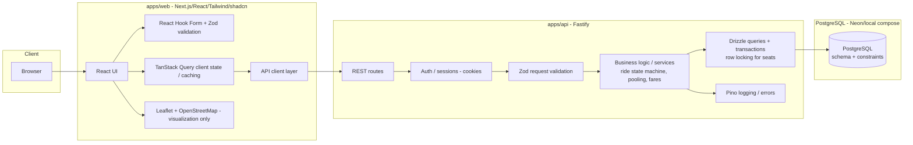

# Architecture — Dhaka Tesla Pool (MVP)

> Proposed architecture for the MVP. Current best-effort design, not final.
> Any material change must be documented here and in `docs/decisions.md`.

## 1. Overview

Dhaka Tesla Pool is built as a **modular monolith**: one Node.js API serving one
web frontend, sharing one PostgreSQL database, organized as an npm-workspaces
monorepo with two applications under `apps/`.

```
Browser
  → Next.js (apps/web)
  → Node.js/Fastify API (apps/api)
  → PostgreSQL
```

The frontend never talks to PostgreSQL directly; all business rules live in the
API. This matches the PRD's "Architecture First" section
(`docs/requirements.md` §10) and keeps the evaluatable surface simple.

## 2. Architecture Diagram



## 3. Component Responsibilities

> Phase-1 note: the sections below describe the **target** architecture. As of
> Phase 1 the implemented surface is: minimal Next.js App Router app, Fastify
> app with `GET /health`, env config, Pino logging, JSON error envelope, and a
> Drizzle client + migration tooling. Everything not yet implemented is marked.

### 3.1 Frontend (`apps/web`)
- Phase 1: minimal App Router scaffold (`app/layout.tsx`, `app/page.tsx`
  status page), dev server, production build, tsc type check, ESLint.
- Later phases: passenger and driver flows (sign-in, request ride, status
  tracking, driver accept/arrive/start/complete).
- **Runs client-side form validation with Zod (via React Hook Form) but never
  relies on it** — it is UX-only (Phase 9).
- Uses TanStack Query for data fetching, caching, and loading/error/empty states
  (Phase 9).
- Leaflet renders predefined Dhaka zones and route polylines on OpenStreetMap —
  **visualization only**, no routing (Phase 9).
- Communicates with the API only through the API client layer using
  `NEXT_PUBLIC_API_URL`.

### 3.2 Backend (`apps/api`)
- Fastify REST API. Owns **all validation, authorization, and business logic**.
- Phase 1: application bootstrap (`src/app.ts`), server entry (`src/server.ts`),
  environment configuration (`src/config.ts`), Pino logging, JSON error
  envelope, `GET /health` liveness endpoint, and a Drizzle foundation
  (`src/db/`): client, `db:check`, `db:migrate`, empty schema.
- Later phases: ride state machine, capacity enforcement via transactional seat
  allocation (`SELECT … FOR UPDATE` + constraint checks), individual passenger
  fares (integer paisa/poysha), application-owned cookie sessions with Argon2id
  and role-based authorization (passenger/driver).

### 3.3 Database (PostgreSQL)
- Phase 1: PostgreSQL 16 in Docker Compose (healthcheck + persistent named
  volume); Drizzle migration runner verified against it.
- Phase 2 (complete): real schema implemented and migrated — `users`,
  `sessions`, `vehicles` (+ fixed capacity), `zones`, `ride_requests`,
  `pools`, `pool_members`, `fares`, `ride_status_history`. Invariants enforced
  with CHECK/unique/partial-unique constraints and sensible indexes; money is
  integer paisa/poysha; the lifecycle (`REQUESTED → MATCHED → DRIVER_ARRIVED →
  STARTED → COMPLETED (+ CANCELLED)`) is a PostgreSQL enum. Deterministic,
  idempotent seed with the PRD cast (Jashim/Bullet/Nusrat/Rafiq/Shirin).
  See [docs/database.md](database.md).
- Later phases: single source of truth for ride behavior; capacity enforcement
  via transactional seat allocation (`SELECT … FOR UPDATE` + derived occupancy
  sum), individual passenger fares (integer paisa/poysha), application-owned
  cookie sessions with Argon2id and role-based authorization (passenger/driver).
- Occupied seats are always **derived** from ACTIVE `pool_members` rows — there
  is no cached "available seats" counter. Concurrency approach documented in
  `docs/database.md` §7.

## 4. Boundaries

| Boundary | Held by | Why |
|---|---|---|
| **Authentication** | API (cookies, Argon2id) | Backend ownership; frontend only receives a session cookie. |
| **Authorization** | API (role checks + owner checks) | A passenger must never modify another passenger's ride. |
| **Business logic** | API services | Fare, pooling, and lifecycle must be testable in isolation; never trusted client-side. |
| **Database access** | API via Drizzle | Frontend never reaches PostgreSQL. |
| **Map** | Frontend (Leaflet + OSM) | Visualization only; no routing engine needed. |

## 5. Why a Modular Monolith (and not microservices)

- The MVP is one team, one domain, one deployable backend. Microservices would
  add network hops, contracts, and failure modes without any PRD benefit.
- The PRD explicitly warns against microservices/Kafka/Kubernetes/Redis/queues
  unless there is a *reason* (`docs/requirements.md` §10).
- The seam for later modular extraction is preserved: `apps/api` internals are
  organized by domain (auth, rides, pools, fares), so a future split into
  separate services would keep service boundaries intact.
- Single deployable simplifies `docker compose up`, free-tier hosting, and the
  "shipped, not just coded" requirement.

## 6. What Would Change at Larger Scale

Recording potential future changes (not implemented now — see bonus analysis in
`docs/development-plan.md` Phase 12 and `docs/requirements.md` §15):

- Split web/API into separate deploys (already separate apps in the monorepo).
- Read replicas + bigger indexes; move seat-allocation locking under contention
  analysis; queues for matching/notifications; cache hot reads.
- These are documented reasoning, not built into the MVP.

## 7. Deployment Topology (proposed)

```
Vercel (Next.js frontend)  →  Render (Fastify API)  →  Neon (PostgreSQL)
```

- Free tier only. If free backend hosting is unavailable, fall back to a
  reproducible Docker deployment (documented at that time).

## 8. Implementation Status (Phase 1)

Implemented and verified:

- Monorepo npm workspaces: `@dhaka-tesla-pool/api`, `@dhaka-tesla-pool/web`.
- Docker Compose full stack (web + api + db) with healthchecks, built and
  started via `docker compose up --build` on Windows.
- API `GET /health` (local and in-container), Pino logging, JSON errors.
- Drizzle/postgres.js client, `db:check` (`SELECT 1` -> ok), `db:migrate`
  (creates `drizzle.__drizzle_migrations`), `drizzle-kit generate` (empty schema).
- CI workflow: install → lint → typecheck → test → build.

## 9. Implementation Status (Phase 2)

Implemented and verified (schema, migration, seed, tests — see
[docs/database.md](database.md)):

- Full Phase 2 schema: 9 tables + 3 PostgreSQL enums, UUID PKs, tz-aware UTC
  timestamps, integer-paisa money, CHECK/unique/partial-unique constraints.
- Migration `apps/api/drizzle/0000_whole_queen_noir.sql` generated by
  `drizzle-kit`, reviewed, committed unmodified; applied cleanly to the
  container database and reapply is a no-op.
- Idempotent deterministic seed (`npm run db:seed`): Jashim (driver) + Bullet
  (capacity 3, online) + Nusrat/Rafiq/Shirin + 8 predefined Dhaka zones.
- Schema-integration tests (21 in `apps/api/test/database.test.ts`) verify
  migration, seed, unique-email, positive-seats, duplicate-membership, FK
  integrity, negative-fare and cyclic-state-history rejection, and more. They
  run per-suite against a disposable `<db>_test` database and skip when no
  PostgreSQL is reachable; CI provides a Postgres service.
- CI now runs the DB tests against a `postgres:16-alpine` service container.

Not yet implemented (later phases): auth, validation on routes, ride state
machine, pooling, fares, concurrency, map visualization, deployment to
Vercel/Render/Neon.