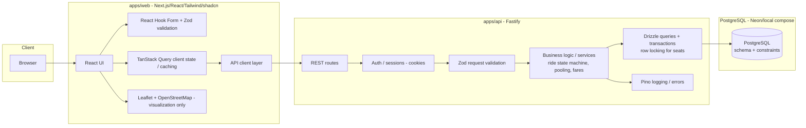

# Architecture — Dhaka Tesla Pool (MVP)

> Proposed architecture for the MVP. Current best-effort design, not final.
> Any material change must be documented here and in `docs/decisions.md`.

## 1. Overview

Dhaka Tesla Pool is built as a **modular monolith**: one Node.js API serving one
web frontend, sharing one PostgreSQL database, organized as an npm-workspaces
monorepo with two applications under `apps/`.

```
Browser
  → Next.js (apps/web)
  → Node.js/Fastify API (apps/api)
  → PostgreSQL
```

The frontend never talks to PostgreSQL directly; all business rules live in the
API. This matches the PRD's "Architecture First" section
(`docs/requirements.md` §10) and keeps the evaluatable surface simple.

## 2. Architecture Diagram



## 3. Component Responsibilities

### 3.1 Frontend (`apps/web`)
- Renders passenger and driver flows (sign-in, request ride, status tracking,
  driver accept/arrive/start/complete).
- **Runs client-side form validation with Zod (via React Hook Form) but never
  relies on it** — it is UX-only.
- Uses TanStack Query for data fetching, caching, and loading/error/empty states.
- Leaflet renders predefined Dhaka zones and route polylines on OpenStreetMap —
  **visualization only**, no routing.
- Communicates with the API only through the API client layer using
  `NEXT_PUBLIC_API_URL`.

### 3.2 Backend (`apps/api`)
- Fastify REST API. Owns **all validation, authorization, and business logic**.
- Implements the ride state machine and rejects invalid transitions.
- Enforces pool capacity with transactional seat allocation
  (`SELECT … FOR UPDATE` + constraint checks).
- Computes individual passenger fares (integer paisa/poysha).
- Application-owned cookie sessions, Argon2id password hashing, role-based
  authorization (passenger/driver).
- Structured logging with Pino; consistent error envelope.

### 3.3 Database (PostgreSQL)
- Single source of truth for users, vehicles, ride requests, pools, pool
  membership, ride status history, fares, sessions, zones.
- Enforces invariants with schema constraints (see `docs/database.md`):
  capacity bounds, explicit membership, state-transition validity, per-passenger
  fare preservation.
- Drizzle ORM maps schema and runs migrations and typed queries.

## 4. Boundaries

| Boundary | Held by | Why |
|---|---|---|
| **Authentication** | API (cookies, Argon2id) | Backend ownership; frontend only receives a session cookie. |
| **Authorization** | API (role checks + owner checks) | A passenger must never modify another passenger's ride. |
| **Business logic** | API services | Fare, pooling, and lifecycle must be testable in isolation; never trusted client-side. |
| **Database access** | API via Drizzle | Frontend never reaches PostgreSQL. |
| **Map** | Frontend (Leaflet + OSM) | Visualization only; no routing engine needed. |

## 5. Why a Modular Monolith (and not microservices)

- The MVP is one team, one domain, one deployable backend. Microservices would
  add network hops, contracts, and failure modes without any PRD benefit.
- The PRD explicitly warns against microservices/Kafka/Kubernetes/Redis/queues
  unless there is a *reason* (`docs/requirements.md` §10).
- The seam for later modular extraction is preserved: `apps/api` internals are
  organized by domain (auth, rides, pools, fares), so a future split into
  separate services would keep service boundaries intact.
- Single deployable simplifies `docker compose up`, free-tier hosting, and the
  "shipped, not just coded" requirement.

## 6. What Would Change at Larger Scale

Recording potential future changes (not implemented now — see bonus analysis in
`docs/development-plan.md` Phase 12 and `docs/requirements.md` §15):

- Split web/API into separate deploys (already separate apps in the monorepo).
- Read replicas + bigger indexes; move seat-allocation locking under contention
  analysis; queues for matching/notifications; cache hot reads.
- These are documented reasoning, not built into the MVP.

## 7. Deployment Topology (proposed)

```
Vercel (Next.js frontend)  →  Render (Fastify API)  →  Neon (PostgreSQL)
```

- Free tier only. If free backend hosting is unavailable, fall back to a
  reproducible Docker deployment (documented at that time).