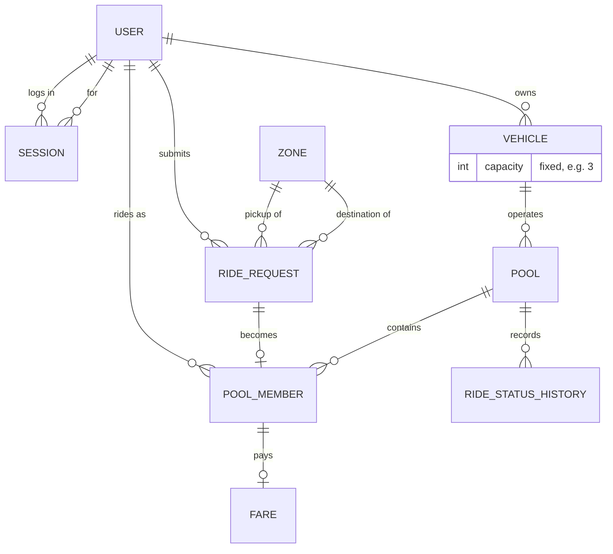

# Database Design — Dhaka Tesla Pool (MVP)

> Proposed entities and relationships for the MVP. This document intentionally
> does **not** define the final schema or migrations yet — that happens in a
> later phase. It records entity purposes, relationships, invariants, and open
> questions that must be resolved before schema implementation.

## 1. Design Goals

- Model the PRD's world faithfully: users, Teslas/vehicles + fixed capacity,
  ride requests, pools, pool membership, status/history, fares, sessions,
  optional audit information.
- Enforce invariants in the database where appropriate (constraints), not only
  in application code.
- Money as **integer paisa/poysha** (never floating-point).
- Enables the six required test behaviors, including the concurrency case.

## 2. Entities and Relationships

### 2.1 User
- **Purpose:** passengers and drivers in one table, distinguished by `role`
  (passenger / driver).
- **Relationships:** has many Sessions; driver owns many Vehicles/Teslas;
  submits many Ride Requests.
- **Constraints/invariants:**
  - Unique email/login identifier.
  - Password stored as Argon2id hash only.
  - `role` cannot change in a way that invalidates existing ride data.

### 2.2 Session
- **Purpose:** application-owned cookie session, server-side, revocable.
- **Relationships:** belongs to one User.
- **Constraints/invariants:**
  - Signed, `HttpOnly` cookie; session row has expiry.
  - Expired sessions cannot authenticate.

### 2.3 Vehicle / Tesla
- **Purpose:** Bullet — a three-seat, battery-powered Tesla with `capacity` =
  3 and a driver owner.
- **Relationships:** owned by a driver User (1:N, driver may own several);
  has many Pools/Rides over its lifetime.
- **Constraints/invariants:**
  - `capacity > 0`, fixed for the MVP.
  - A vehicle can only have **one active ride/pool** at a time.
  - "Occupied seats never exceed capacity" is enforced here and at pool level.

### 2.4 Zone
- **Purpose:** predefined Dhaka areas (Banani, Gulshan, Mohakhali, Dhanmondi,
  Mirpur, Uttara, Farmgate, Bashundhara, …) with plain lat/long points.
- **Relationships:** referenced by Ride Requests (pickup/destination).
- **Constraints/invariants:**
  - Unique zone name; lat/long range checked.

### 2.5 Ride Request
- **Purpose:** a passenger's request: pickup zone, destination zone, number of
  seats, requested state (REQUESTED…).
- **Relationships:** belongs to a passenger User; references pickup/destination
  Zones; may become a member of a Pool.
- **Constraints/invariants:**
  - `seats ≥ 1`; pickup ≠ destination.
  - A passenger cannot modify another passenger's request.
  - State tracked explicitly (state machine).

### 2.6 Pool
- **Purpose:** the "Ride/Pool" actor — one Tesla carrying one or more passengers
  whose requests are compatible. **Pool membership must be explicit.**
- **Relationships:** belongs to a Vehicle/Tesla; has many Pool Members; has a
  ride lifecycle (REQUESTED → MATCHED/ACCEPTED → DRIVER_ARRIVED → STARTED →
  COMPLETED, + CANCELLED).
- **Constraints/invariants:**
  - Sum of member seats ≤ vehicle capacity (never exceeded — DB constraint +
  transactional locking).
  - One active Pool per vehicle at a time.
  - State transitions explicit and validated.

### 2.7 Pool Member
- **Purpose:** the join between a Passenger and a Pool — the **explicit proof of
  membership**.
- **Relationships:** belongs to a Pool; belongs to a Ride Request (hence User).
- **Constraints/invariants:**
  - A passenger request can belong to at most one active Pool.
  - Membership carries the passenger's individual fare snapshot.

### 2.8 Fare
- **Purpose:** per-passenger, per-request fare snapshot.
- **Relationships:** belongs to a Pool Member (and/or Ride Request).
- **Constraints/invariants:**
  - Integer paisa/poysha, never float.
  - Stored snapshot so later parameter changes never rewrite history.
  - Formula: `passengerFare = baseFare + distanceCharge − poolDiscount`
    (parameters documented; hand-verifiable on Nusrat/Rafiq trip).

### 2.9 Ride Status History
- **Purpose:** append-only journal of a ride's (or pool's) state transitions so
  history is explainable.
- **Relationships:** belongs to a Pool/Ride.
- **Constraints/invariants:**
  - Append-only; each record = (state, at, by whom, optional reason).
  - Required for "explain exactly what happened."

### 2.10 Audit (optional)
- **Purpose:** optional trace of sensitive or admin-relevant actions.
- **Relationships:** loose reference table (subject, actor, action, timestamp).
- **Constraints/invariants:** append-only.

## 3. Proposed ERD (conceptual)

## 4. Key Integrated Invariants

1. **Capacity never exceeded** — pool rows carry used seats; a CHECK /
   trigger-level guard plus `SELECT … FOR UPDATE` on the vehicle/pool seat
   count when joining a pool. Handles Nusrat vs. Shirin on Bullet's last seat.
2. **Explicit membership** — a passenger joins a Pool only through a
   `pool_members` row; there is no implicit "in the pool because same zones".
3. **State transitions** — `ride_status_history` plus a transition validator in
   the API; invalid transitions rejected at API and enforced at DB level.
4. **Fare preservation** — `fares` snapshot columns, integer paisa.
5. **Ownership isolation** — every query on a passenger's ride is scoped by
   `user_id`; authorization checks in API.
6. **History explainability** — append-only status journal + fare snapshots.

## 5. Open Questions Before Schema Implementation

1. **Indexing strategy** — which indexes are needed for matching queries
   (status + zone + vehicle active) and history lookups? (Phase 8 scan.)
2. **Pool vs original ride request** — does the Ride Request itself carry state,
   or only the Pool? (Affects passenger status display.)
3. **Exact cancellation accounting** — when a member cancels, how are seats and
   fares re-computed for the remaining members' snapshots?
4. **Multiple active vehicles per driver** — schema supports 1:N; does the MVP
   need simultaneous operation or one active vehicle per driver?
5. **Seat-level fare** — a request with `seats=2`: two fares or one fare × 2?
   (See requirements §21.K.)
6. **Decimal/paisa rounding** — exact rounding rule for pooled discounts
   (banker's vs. half-up) must be fixed before tests are written.
7. **ID strategy** — UUID vs. serial; and whether session tokens are opaque
   random vs. signed.
8. **Timestamps** — timezone handling (store UTC) and clock source for status
   history ordering.