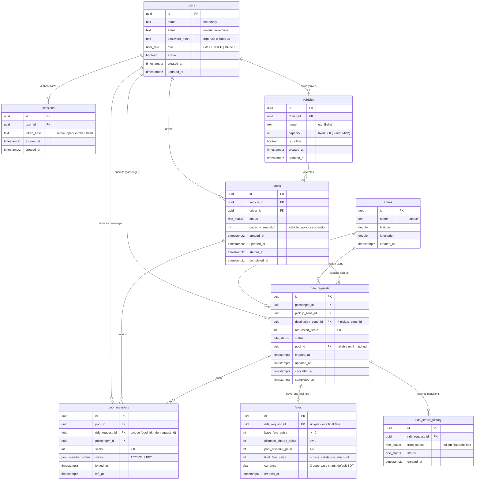

# Database Design — Dhaka Tesla Pool (MVP)

> **Status:** Phase 2 complete. The schema described here is implemented in
> `apps/api/src/db/schema.ts`, migrated by `apps/api/drizzle/0000_*.sql`, and
> exercised by `apps/api/test/database.test.ts`. The ERD below reflects the
> **actual** schema. Everything else here is a record of the design decisions,
> invariants, and planned later-phase behavior (which is marked as such).

## 1. Design Goals

- Model the PRD's world faithfully: users, Teslas/vehicles + fixed capacity,
  ride requests, pools, pool membership, status/history, fares, sessions.
- Enforce invariants in the database where appropriate (constraints), not only
  in application code.
- Money as **integer paisa/poysha** (never floating-point).
- Support the six required test behaviors, including the concurrency case.
- `ride_status_history` + fare snapshots exist so history is **explainable**.

## 2. Implementation Overview

- **Driver:** PostgreSQL 16, Drizzle ORM (schema in `src/db/schema.ts`).
- **Primary keys:** UUID v4, default `gen_random_uuid()` (PG >= 13 built-in).
- **Timestamps:** `timestamptz` (timezone-aware), default `now()`, stored UTC.
- **Enums (PostgreSQL-native):**
  - `user_role`: `PASSENGER`, `DRIVER`
  - `ride_status`: `REQUESTED`, `MATCHED`, `DRIVER_ARRIVED`, `STARTED`,
    `COMPLETED`, `CANCELLED`
  - `pool_member_status`: `ACTIVE`, `LEFT`
- **Money:** integer paisa in `*_paisa` columns; currency is a 3-char code
  (`BDT` default, uppercase; see §6).

## 3. Tables

### 3.1 `users`

| column | type | notes |
|---|---|---|
| `id` | uuid PK | default `gen_random_uuid()` |
| `name` | text NOT NULL | CHECK non-empty |
| `email` | text NOT NULL UNIQUE | stored lowercase (CHECK `email = lower(email)`) |
| `password_hash` | text NOT NULL | Argon2id hash (auth in Phase 3) |
| `role` | `user_role` NOT NULL DEFAULT `PASSENGER` | |
| `active` | boolean NOT NULL DEFAULT `true` | |
| `created_at` / `updated_at` | timestamptz NOT NULL DEFAULT `now()` | |

One table for both passenger and driver, distinguished by `role`.

### 3.2 `sessions`

Application-owned cookie session rows (auth implemented in Phase 3).

| column | type | notes |
|---|---|---|
| `id` | uuid PK | |
| `user_id` | uuid NOT NULL → `users.id` | ON DELETE CASCADE |
| `token_hash` | text NOT NULL UNIQUE | hash of the opaque token; raw token never stored |
| `expires_at` | timestamptz NOT NULL | |
| `created_at` | timestamptz NOT NULL | |

Indexed on `user_id` and `expires_at` (purge/query of expired sessions).

### 3.3 `vehicles`

The driver-owned Tesla with a **fixed capacity**.

| column | type | notes |
|---|---|---|
| `id` | uuid PK | Jashim's Tesla is seeded as **Bullet** |
| `driver_id` | uuid NOT NULL → `users.id` | ON DELETE CASCADE |
| `name` | text NOT NULL | e.g. "Bullet"; CHECK non-empty |
| `capacity` | integer NOT NULL | CHECK `> 0`; MVP convention is 3 seats |
| `is_online` | boolean NOT NULL DEFAULT `false` | partial index `WHERE is_online` for matching |
| `created_at` / `updated_at` | timestamptz | |

Indexed on `driver_id`. A vehicle's current capacity is **not** authoritative for
history — pools snapshot it into `capacity_snapshot` (see §6.6).

### 3.4 `zones`

Predefined Dhaka geography — plain lat/long points, **no routing/geocoding**.

| column | type | notes |
|---|---|---|
| `id` | uuid PK | |
| `name` | text NOT NULL UNIQUE | e.g. "Banani", "Gulshan 1" |
| `latitude` | double precision, CHECK `-90..90` | |
| `longitude` | double precision, CHECK `-180..180` | |
| `created_at` | timestamptz | |

### 3.5 `ride_requests`

A passenger's request: pickup zone, destination zone, number of seats, status.
The lifecycle enum is the PRD's `REQUESTED → MATCHED → DRIVER_ARRIVED → STARTED
→ COMPLETED (+ CANCELLED)`. See §5.2 for why "MATCHED/ACCEPTED" is stored as
`MATCHED`.

| column | type | notes |
|---|---|---|
| `id` | uuid PK | |
| `passenger_id` | uuid → `users.id` | RESTRICT |
| `pickup_zone_id` | uuid → `zones.id` | RESTRICT; CHECK ≠ destination |
| `destination_zone_id` | uuid → `zones.id` | RESTRICT |
| `requested_seats` | integer NOT NULL | CHECK `> 0` |
| `status` | `ride_status` NOT NULL DEFAULT `REQUESTED` | |
| `pool_id` | uuid → `pools.id` NULL | **nullable while unassigned**; CHECK "set ⇒ not REQUESTED" |
| `created_at` / `updated_at` | timestamptz NOT NULL | |
| `cancelled_at` | timestamptz NULL | CHECK: set exactly when `status = CANCELLED` |
| `completed_at` | timestamptz NULL | CHECK: set exactly when `status = COMPLETED` |

Indexed on `(passenger_id, created_at)` (history), `status` (matching), and
`pool_id` (pool lookup + FK). `pool_id` is a **display convenience**; the
authoritative membership is `pool_members` (§3.7).

### 3.6 `pools`

A set of matched ride requests being served by **one Tesla**.

| column | type | notes |
|---|---|---|
| `id` | uuid PK | |
| `vehicle_id` | uuid → `vehicles.id` | RESTRICT |
| `driver_id` | uuid → `users.id` | RESTRICT; must equal the vehicle's driver (app-enforced) |
| `status` | `ride_status` NOT NULL DEFAULT `REQUESTED` | pool carries the same lifecycle |
| `capacity_snapshot` | integer NOT NULL | CHECK `> 0`; vehicle capacity copied at pool creation |
| `created_at` / `updated_at` | timestamptz | |
| `started_at` | timestamptz NULL | CHECK: set only for `STARTED`/`COMPLETED` |
| `completed_at` | timestamptz NULL | CHECK: set exactly when `COMPLETED`; requires `started_at` |

**Partial unique index:** `pools_single_active_per_vehicle` — a vehicle can
have at most one pool in a non-terminal state (`NOT IN ('COMPLETED','CANCELLED')`).
This is a first-class capacity/concurrency invariant at the DB layer.

### 3.7 `pool_members`

The **explicit proof of membership** — a passenger's request riding in a pool.
This table is the source of truth for occupied seats.

| column | type | notes |
|---|---|---|
| `id` | uuid PK | |
| `pool_id` | uuid → `pools.id` | RESTRICT |
| `ride_request_id` | uuid → `ride_requests.id` | RESTRICT |
| `passenger_id` | uuid → `users.id` | RESTRICT |
| `seats` | integer NOT NULL | CHECK `> 0` (matched by the membership) |
| `status` | `pool_member_status` NOT NULL DEFAULT `ACTIVE` | `ACTIVE` = occupies seats |
| `joined_at` | timestamptz NOT NULL | |
| `left_at` | timestamptz NULL | CHECK: set exactly when `status = LEFT` |

Constraints:
- `UNIQUE (pool_id, ride_request_id)` — a request cannot join the same pool twice.
- **Partial unique** `pool_members_one_active_per_request` — a request has at
  most **one ACTIVE** membership (it can be in only one pool at a time).
- Index `(pool_id, status)` — this is what occupancy aggregates use.

### 3.8 `fares`

Individual, per-request **final fare snapshot** in integer paisa.

| column | type | notes |
|---|---|---|
| `id` | uuid PK | |
| `ride_request_id` | uuid → `ride_requests.id` | RESTRICT; **UNIQUE** — one final fare per request |
| `base_fare_paisa` | integer NOT NULL | CHECK `>= 0` |
| `distance_charge_paisa` | integer NOT NULL | CHECK `>= 0` |
| `pool_discount_paisa` | integer NOT NULL | CHECK `>= 0` |
| `final_fare_paisa` | integer NOT NULL | CHECK `>= 0` **and** `= base + distance − discount` |
| `currency` | char(3) NOT NULL DEFAULT `BDT` | CHECK 3 uppercase letters |
| `created_at` | timestamptz | |

The formula `passengerFare = baseFare + distanceCharge − poolDiscount` is
enforced by a CHECK so stored history can never contradict the documented fare
model. **Fare calculation itself is implemented in a later phase** (the value
parameters are defined in `docs/requirements.md` §21.D).

### 3.9 `ride_status_history`

Append-only journal of a request's lifecycle transitions.

| column | type | notes |
|---|---|---|
| `id` | uuid PK | |
| `ride_request_id` | uuid → `ride_requests.id` | RESTRICT |
| `from_status` | `ride_status` NULL | null on the first recorded transition |
| `status` | `ride_status` NOT NULL | |
| `created_at` | timestamptz NOT NULL | |

CHECK `from_status IS NULL OR from_status <> status` (no self-transitions).
Index `(ride_request_id, created_at)` = chronological audit trail.

The **state machine that writes these rows** (and validates legal transitions)
is implemented in the ride/pooling phases (8+). The DB enforces the enum values
and self-transition rule; it cannot derive transitions from the current row, so
writing history atomically with state changes is an application control.

## 4. ERD



## 5. Design Decisions (schema)

### 5.1 Enums match the PRD lifecycle exactly
`ride_status` is a PostgreSQL enum type (not a text/varchar) so invalid states
are rejected by the database and the lifecycle reads clearly in `psql`.

### 5.2 "MATCHED/ACCEPTED" is stored as `MATCHED`
The PRD writes the single state as "MATCHED/ACCEPTED". It is modeled as one enum
value, `MATCHED`. A pooled request/pool in `MATCHED` has been accepted by the
driver; there is no separate "ACCEPTED" column or value. One value = one naming
scheme, no ambiguity in history rows. See also `docs/decisions.md` ADR-012.

### 5.3 `pool_id` on `ride_requests` is a convenience; `pool_members` is truth
The DB's source of truth for "this request rides in this pool" is `pool_members`
(which carries the same passenger, seats, and join/leave history). `ride_requests.pool_id`
is denormalized for the passenger-facing status view and is kept consistent by
the pooling service. The DB guards the obvious impossible value: a request with
`pool_id` set is never `REQUESTED`.

### 5.4 Membership history is preserved
`pool_members` rows are never deleted or overwritten (ON DELETE RESTRICT +
explicit `LEFT` status + `left_at`). "Who was in which pool when" always
remains answerable.

### 5.5 Occupied seats are derived, not cached
**There is no `available_seats` / `occupied_seats` column anywhere.** Occupied
seats for a pool are always computed as:

```sql
SELECT COALESCE(SUM(seats), 0)
FROM pool_members
WHERE pool_id = $1 AND status = 'ACTIVE';
```

Comparing that sum to `pools.capacity_snapshot` is the capacity check. This
avoids the classic cache-divergence bug where a cached counter drifts from the
truth. The DB still enforces the structural bounds (`seats > 0`, snapshots
positive, one active pool per vehicle, one active membership per request); the
**aggregate** occupancy vs. capacity check is transactional application logic
(§7) because it spans rows.

### 5.6 `capacity_snapshot` preserves history
`pools.capacity_snapshot` copies `vehicles.capacity` at pool creation. If Bullet
is ever reconfigured, old pools still show the capacity that applied to them.
The app must set `capacity_snapshot = vehicle.capacity` when creating a pool
(cross-table, not a CHECK).

### 5.7 Delete policy: ride history is RESTRICT, infrastructure is CASCADE
Every ride-domain FK (`ride_requests`, `pools`, `pool_members`, `fares`,
`ride_status_history`) uses `ON DELETE RESTRICT`: ride data is history and must
stay explainable (`docs/requirements.md` §21.I); attempts to delete a user with
rides fail loudly instead of silently destroying history. `sessions` and
`vehicles` are user-owned infrastructure and use `ON DELETE CASCADE`.

### 5.8 Email uniqueness is case-insensitive by construction
Emails are stored lowercase (CHECK `email = lower(email)`) under a plain unique
index, so `Nusrat@Example.com` and `nusrat@example.com` cannot both exist
without a functional index. The app normalizes on write (Phase 3).

### 5.9 No generic "audit" table
The PRD marks audit **optional**. `ride_status_history` + fare snapshots already
make every ride explainable; a catch-all audit table would add a second,
redundant journal with no current consumer. Skipped until an actual need exists,
per the "no complexity without a reason" rule.

### 5.10 What the DB does NOT enforce (application boundary — documented)
These require cross-table or cross-row knowledge a simple SQL constraint cannot
express. The application enforces them in later phases; this list is the record:

- **Only a `DRIVER` owns a vehicle** — needs a users lookup; CHECK cannot
  reference another table. Enforced by the app when creating vehicles.
- **`pools.driver_id` equals `vehicles.driver_id`** — cross-table equality.
- **Occupancy never exceeds `capacity_snapshot`** — spans membership rows;
  enforced transactionally with row locking (see §7).
- **Valid state transitions** — depend on the previous state; enforced by the
  state machine and recorded in `ride_status_history`.
- **`requested_seats` ≤ vehicle capacity / ≤ `3`** — the MVP convention is a
  three-seat Tesla; the DB enforces positivity, matching logic enforces the cap.
- **`status` values other than enum members** — the enum handles this one; all
  *transition* legality is app-enforced once a journal row exists.

## 6. Constraints and Indexes (with rationale)

Every constraint and index in the migration exists for a reason; non-obvious
ones are explained inline in `src/db/schema.ts` and summarized here.

### CHECK constraints
| table | name | purpose |
|---|---|---|
| users | `users_email_unique`, `users_name_not_empty`, `users_email_lowercase` | login identity integrity; no empty/whitespace names; sane email uniqueness |
| vehicles | `vehicles_name_not_empty`, `vehicles_capacity_positive` | no blank labels; capacity is a positive integer |
| zones | `zones_name_not_empty`, `zones_latitude_range`, `zones_longitude_range` | reference data sanity (valid WGS84 bounds) |
| ride_requests | `ride_requests_seats_positive` | a request always asks for at least one seat |
| | `ride_requests_pickup_ne_destination` | pickup === destination is meaningless |
| | `ride_requests_cancel_timestamp` / `_complete_timestamp` | terminal state ⇔ its timestamp; impossible states rejected |
| | `ride_requests_single_terminal` | can't be both cancelled and completed |
| | `ride_requests_pool_requires_matched` | pooled requests have left REQUESTED |
| pools | `pools_capacity_snapshot_positive` | snapshot always meaningful |
| | `pools_started_timestamp` / `pools_complete_timestamp` / `pools_complete_requires_started` | started/completed timestamps only ever match the lifecycle; a pool can't complete without starting |
| pool_members | `pool_members_seats_positive` | a membership always takes ≥ 1 seat |
| | `pool_members_left_timestamp` | LEFT ⇔ `left_at` |
| fares | `fares_monetary_non_negative` | no negative money |
| | `fares_final_equals_formula` | stored fares always obey the documented formula |
| | `fares_currency_format` | 3 uppercase letter currency code |
| ride_status_history | `ride_status_history_no_same_transition` | no self-transitions in the audit journal |

### Unique constraints / indexes
| table | name | purpose |
|---|---|---|
| users | `users_email_unique` | one account per email |
| sessions | `sessions_token_hash_unique` | token lookup is exact |
| zones | `zones_name_unique` | deterministic, named geography |
| ride_requests | (none beyond PK) | requests are never unique by content |
| pools | `pools_single_active_per_vehicle` (**partial**) | a Tesla runs at most one active pool — capacity + concurrency integrity |
| pool_members | `pool_members_pool_request_unique` | no request twice in the same pool |
| pool_members | `pool_members_one_active_per_request` (**partial**) | a request in at most one active pool |
| fares | `fares_one_per_ride_request` | exactly one final fare per request |

### Plain indexes
| table | name | purpose |
|---|---|---|
| sessions | `sessions_user_id_idx`, `sessions_expires_at_idx` | session lookups + expiry purge |
| vehicles | `vehicles_driver_id_idx` | "my Teslas" |
| vehicles | `vehicles_is_online_idx` (**partial**) | matching scans only consider online Teslas |
| ride_requests | `ride_requests_passenger_history_idx` | passenger history (and passenger FK) |
| ride_requests | `ride_requests_status_idx` | wait for REQUESTED requests during matching |
| ride_requests | `ride_requests_pool_idx` | requests in a pool (+ pool FK) |
| pools | `pools_vehicle_idx`, `pools_driver_idx`, `pools_status_idx` | FK lookups + matching scans |
| pool_members | `pool_members_pool_status_idx` | **occupancy aggregation** `WHERE pool_id AND status` |
| pool_members | `pool_members_ride_request_idx` | FK enforcement + reverse lookup |
| pool_members | `pool_members_passenger_idx` | passenger ride history joins |
| ride_status_history | `ride_status_history_transitions_idx` | chronological audit + FK |

Deliberately **not** indexed (documented choice): `ride_requests.pickup_zone_id`
/ `destination_zone_id`. Zones are effectively immutable reference data; there is
no reverse query path, and a (never-occurring) zone delete only costs a scan on
the FK restriction.

## 7. Concurrency Strategy (planned for the pooling phase — NOT yet implemented)

**What must hold:** Bullet has 1 seat left. Nusrat and Shirin both try to claim
it at nearly the same instant; both may read `occupied = 2`, and exactly one of
them may join. This is Phase 3/4+ work — the **service** that implements it does
not exist yet; this section documents the planned approach against the schema
we now have (PRD §12 and `docs/requirements.md` §14).

**Planned strategy — DB-backed transactional consistency, database as truth:**

1. `BEGIN` (default `read committed` or `repeatable read` is acceptable).
2. `SELECT ... FOR UPDATE` on the **pool row** to serialize claims per pool. This
   locks `pools` for the row being joined, so the two concurrent claims queue
   instead of racing.
3. Recompute occupancy inside the transaction:
   `SELECT COALESCE(SUM(seats),0) FROM pool_members WHERE pool_id=$pool AND status='ACTIVE'`.
4. Assert `occupied + new.seats <= capacity_snapshot`; on violation, roll back
   and return a 409/insufficient-seats error.
5. Insert the `pool_members` row (and flip the request to `MATCHED`, with
   `pool_id` updated) in the **same transaction**.
6. Commit. The second claimant's `FOR UPDATE` only sees the committed state and
   correctly fails.

Why this is safe here:
- The **partial unique index** `pools_single_active_per_vehicle` already blocks a
  second active pool on the same Tesla, so all claims funnel through one pool row
  (the locked row).
- Occupancy is **derived** (no cached counter to corrupt).
- `pool_members` uniqueness prevents double-joining even in a racy window.

What would change at larger scale (documented, not built): when a pool row
becomes a hotspot, switch to a dedicated per-pool seat ledger (atomic
`UPDATE counters SET occupied = occupied + n WHERE ... RETURNING` or
`INSERT ... RETURNING` with a check) or move the counter onto the pool row with
`UPDATE ... WHERE occupied+n <= capacity_snapshot` as the atomic gate; read
replicas for every read except the claim; and eventually a queue/event for
latency isolation. These are deliberately deferred — see "Oi Tesla Goes Viral"
notes in `docs/requirements.md` §15.

## 8. Migrations and Seed

### Migration
- Schema → migration via `drizzle-kit generate` (`npm run db:generate`),
  produced `apps/api/drizzle/0000_whole_queen_noir.sql` (3 enums, 9 tables,
  all CHECK/unique/index/partial-index statements). Generated SQL was reviewed
  and is committed **unmodified** — no manual edits unless a documented reason
  forces one.
- Apply with `npm run db:migrate` (uses `apps/api/drizzle/meta/_journal.json`
  so it is incremental and idempotent; re-running is a no-op).
- State: **applied successfully against the Docker PostgreSQL container.**

### Seed (`npm run db:seed`)
Deterministic, **idempotent** (inserts with `ON CONFLICT DO NOTHING`, never
deletes). Contents (the canonical PRD cast — see `src/db/seed.ts`):

| kind | rows |
|---|---|
| users | Jashim Ahmed (DRIVER), Nusrat Haque, Rafiq Rahman, Shirin Islam |
| vehicle | **Bullet** — owned by Jashim, capacity 3, online |
| zones | Banani, Gulshan 1, Mohakhali, Dhanmondi, Mirpur, Uttara, Farmgate, Bashundhara |

IDs are fixed (deterministic) so tests and demos can reference Jashim/Bullet by
a stable UUID. Seeded `password_hash` values are **documented development-only
placeholders** (`dev-only-placeholder::...`); real Argon2id hashing and demo
login arrive with the auth phase.

## 9. Database Commands

```bash
docker compose up db                # start PostgreSQL (persistent volume)
npm run db:check   -w @dhaka-tesla-pool/api   # connectivity: SELECT 1
npm run db:generate -w @dhaka-tesla-pool/api  # generate migration from schema
npm run db:migrate -w @dhaka-tesla-pool/api   # apply pending migrations
npm run db:seed   -w @dhaka-tesla-pool/api    # idempotent cast seed
```

## 10. Invariants (enforced, or app-enforced in a marked phase)

1. A ride request belongs to exactly one passenger — `passenger_id` FK. ✔ DB
2. Requested seats are positive — CHECK. ✔ DB
3. A pool belongs to exactly one Tesla — `vehicle_id` FK + one active pool per
   vehicle. ✔ DB
4. Membership seats are positive — CHECK. ✔ DB
5. A request cannot appear twice in the same pool — `UNIQUE(pool_id, ride_request_id)`. ✔ DB
6. Occupied seats are derived from ACTIVE memberships — no cached counter. ✔ By design
7. Occupied seats never exceed pool capacity — transactional `FOR UPDATE` +
   derived sum (Phase 3/4 pooling service). ⏳ App (documented in §7)
8. A completed/cancelled ride cannot move back to an earlier state — state
   machine + `ride_status_history` (Phase 8). ⏳ App
9. Fare amounts cannot be negative — CHECK. ✔ DB
10. Foreign keys always valid — FKs + restrictive delete policy. ✔ DB