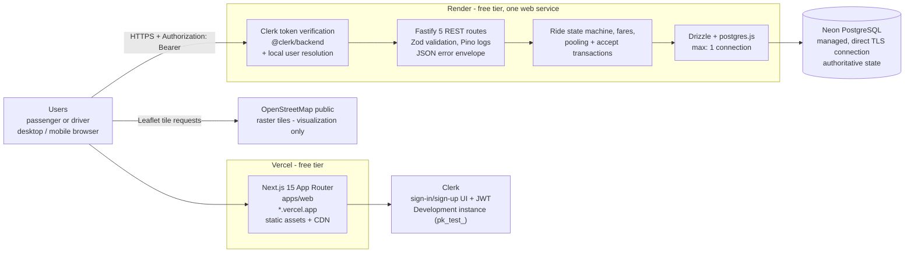
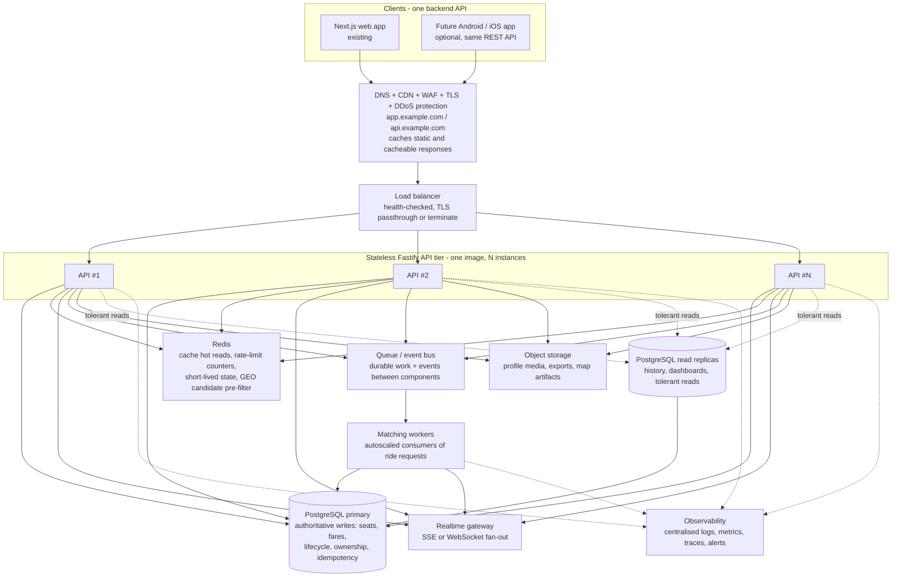
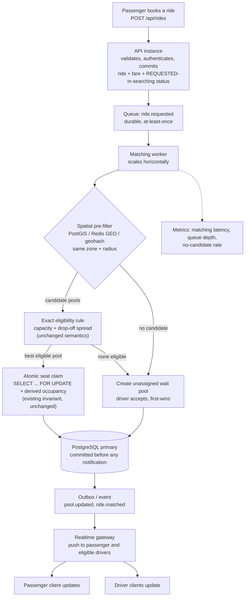

# Scaling Plan — “If Oi Tesla Goes Viral”

> Answers PRD `docs/requirements.md` §15 (Bonus — “If Oi Tesla Goes Viral”):
> *reason through scaling to 1M passengers / 100k drivers — load balancing,
> horizontal scaling, DB indexing/read replicas, caching, geospatial search,
> queues/events, real-time communication, rate limiting, idempotency,
> observability, DB contention, ride matching, retry/failure strategy, security,
> deployment strategy.*
>
> **This is a reasoning document, not an implementation plan.** Nothing described
> after §2 exists in the codebase today. Every “future” component is written as a
> *conditional*: the problem it would solve, the evidence that would justify it,
> and what simpler option comes first. The PRD's own instruction is the point:
> **reasoning matters more than box count**.
>
> Source of truth for the “current” half of this document is the repository
> itself — `apps/api`, `apps/web`, `apps/api/src/db/schema.ts`,
> `docker-compose.yml`, `.github/workflows/ci.yml`, and the existing docs
> (`architecture.md`, `database.md`, `decisions.md`, `requirements.md`,
> `deployment-plan.md`, `frontend-design.md`). Where the PRD and the code
> disagree, the code is described and the difference is called out.
>
> Related: [architecture.md](architecture.md) · [database.md](database.md) ·
> [decisions.md](decisions.md) · [requirements.md](requirements.md) ·
> [deployment-plan.md](deployment-plan.md) · [PRD.pdf](reference/PRD.pdf)

---

## 1. Purpose and Scope

The PRD's bonus asks the candidate to reason about what happens if the product
succeeds far beyond its demo audience — roughly **1,000,000 passengers and
100,000 drivers** — *without over-building the MVP*. That phrase is the real
constraint of this document. A scaling plan that says “add Kubernetes, Kafka,
Redis, six microservices and multi-region” would fail the PRD twice: it ignores
“do not add technologies just to look advanced” (`requirements.md` §10, §19),
and it spends the MVP's entire simplicity budget on traffic that does not exist.

So the document's unit of analysis is **not a component, it is a decision**:

| Question the document must answer for every component |
|---|
| What concrete problem would make this component necessary? |
| Which observable metric or failure mode would be the evidence? |
| What is the *simpler* thing to do (or keep doing) before it? |
| What new failure modes and costs does it introduce? |

### 1.1 The four numbers that are not the same thing

Almost every bad scaling argument starts by treating “1M users” as “1M
simultaneous users”. These are four different quantities, and the architecture
only has to survive the fourth one:

| Concept | Definition | At 1M passengers, roughly |
|---|---|---|
| **Registered** | A row in `users` with a Clerk identity mapped. Almost never active. | 1,000,000 — the PRD target. This is a *storage and signup* scale problem. |
| **Monthly/daily active** | Users who authenticate and render a surface in the period. | A fraction of registered. This is a *session* problem. |
| **Concurrent** | Sessions with an in-flight request right now. | Bounded by the product's own geography: a rider is concurrent only between booking and ride completion. |
| **Request rate** | HTTP requests/second, of which **polling, not user actions, dominates**. | The number that actually sizes the API tier. |

**1,000,000 registered passengers is not 1,000,000 concurrent users.** It is
not even 1,000,000 daily active users. A Dhaka ride-pooling service that
succeeds would plausibly accumulate a large registered base whose *instantaneous*
footprint is governed by trip duration and peak commuting hours — and by the
driver supply, which is the real physical ceiling of this product (§13). The
only thing that genuinely has to be engineered for is **requests per second**,
and §3 derives that honestly from labelled assumptions.

### 1.2 What this document is not

- Not a capacity plan for the current demo — the current demo's bottleneck is
  free-tier instance size and cold starts (§5.1), not architectural depth.
- Not a claim that the current architecture is wrong. §2.3 argues it is
  *correct* for the MVP.
- Not a shopping list. Where a product is named it is because it is a
  representative of a *category* (managed queue, container platform, …), with
  the trigger for adopting it stated alongside.
- Not a commitment. Every phased step in §22 is gated on evidence.

---

## 2. Current MVP Architecture

### 2.1 As deployed



### 2.2 What each piece actually is today

**Frontend — Next.js 15 (App Router), React 19, TypeScript** (`apps/web`)

- Deployed on **Vercel** as a static/server-rendered app; the demo runs on the
  free `*.vercel.app` hostname.
- **Authentication is Clerk's UI**, mounted through `@clerk/nextjs`
  (`ClerkProvider` in the root layout, route policy in `middleware.ts`,
  path-routed catch-all pages under `app/(auth)/`). There is no application
  login form.
- **Data fetching is TanStack Query.** Every authenticated query key is scoped by
  the Clerk `userId` (`["rides", userId]`, `["driver", userId, …]`) so two
  sessions can never share a cache entry; `staleTime` is 30 s and the client is
  cleared when `userId` changes.
- **Realtime is polling.** `pollWhileActive(second = 5000)` in
  `apps/web/lib/queries.ts` sets `refetchInterval: 5000` on the five queries
  that track live work — my rides, ride detail, my accepted pools, the available
  pools lobby, and pool detail. The interval is a *function*, so polling stops
  the moment every returned row is `COMPLETED`/`CANCELLED`.
- **The map is Leaflet + OpenStreetMap raster tiles**, loaded directly from
  `https://{s}.tile.openstreetmap.org/{z}/{x}/{y}.png` (max zoom 19, attribution
  required) in `apps/web/components/workspace/map-pane.tsx`. It draws predefined
  zones and route polylines. **Visualization only** — no routing, no geocoding,
  no GPS.
- Styling is a hand-written always-dark CSS design system (ADR-021 §4). No
  component library.

**Backend — Node.js 24 + Fastify 5** (`apps/api`, TypeScript → `dist/server.js`)

- One stateless-by-design REST API. It holds **no** session state and **no**
  in-process ride state: every request re-verifies the Clerk bearer token with
  `@clerk/backend` and resolves the local user by `users.clerk_user_id`.
- Authorization comes from PostgreSQL (`users.role`, `users.active`) via
  `requireAuth` / `requireRole`. Roles are never read from the client.
- An unknown-but-verified Clerk identity is provisioned as a `PASSENGER` on its
  first authenticated request (`INSERT … ON CONFLICT DO NOTHING`) — ADR-014.
- Validation is **Zod strict schemas**; logging is **Pino** through Fastify's
  logger; errors are a single JSON envelope `{ error: { code, message, details? } }`.
- CORS uses an explicit origin allow-list (`CLERK_AUTHORIZED_PARTIES`), `GET`/`POST`/`OPTIONS`
  only, credentials disabled — because auth is a bearer token, not a cookie.
- `GET /health` is public and unauthenticated; everything under `/api` is behind
  the auth preHandler.
- **What is *not* here, and this matters for §17/§18/§19:** no rate limiting, no
  cache, no queue, no background worker, no compression/security-header plugin,
  no metrics endpoint, no tracing, no WebSocket/SSE server. Polling is the only
  "realtime" mechanism. This is a deliberate MVP scope, not an oversight.

**Database — PostgreSQL via Drizzle ORM**

- **8 tables, 3 PostgreSQL enums:** `users`, `vehicles`, `zones`, `ride_requests`,
  `pools`, `pool_members`, `fares`, `ride_status_history`; enums `user_role`,
  `ride_status`, `pool_member_status`.
- UUID primary keys (`gen_random_uuid()`), `timestamptz` timestamps, **money as
  integer paisa**, lifecycle as a native enum.
- **Invariants live in the database**, not only in services: CHECK constraints
  (positive capacity/seats, fare formula `final = base + distance − discount`,
  no negative money, consistent `cancelled_at`/`completed_at`, assignment
  consistency), UNIQUE constraints (email, one fare per request, one ACTIVE
  membership per request), and **partial unique indexes**
  (`pools_single_accepted_per_driver`, `pools_single_accepted_per_vehicle`,
  `ride_requests_one_active_per_passenger`, `ride_requests_client_request_id_key`).
- **Occupied seats are derived, never cached**: occupancy is
  `SUM(pool_members.seats) WHERE status = 'ACTIVE'`. There is no
  `available_seats` column that could drift (§11.4 explains why this is the
  single most important scaling property of this schema).
- **Concurrency is database-transactional** (ADR-017/020): `claimSeatIn` locks
  the pool row `SELECT … FOR UPDATE` and re-derives occupancy *under the lock*;
  `acceptPool` locks the caller's vehicle rows, then the contested pool row.
  Lock order is **vehicle → rides → pool**, applied consistently so no cycle
  exists between match, cancel, force-cancel and accept.
- **Idempotency**: `POST /api/rides` accepts an optional `client_request_id`
  backed by a partial unique index, so a retried booking replays the winner
  instead of creating a second ride.
- **Migrations** are Drizzle-generated `0000`–`0007`, applied once and recorded
  in `drizzle.__drizzle_migrations`. Seed is idempotent (`ON CONFLICT DO NOTHING`):
  7 users, 4 Teslas, 8 zones, no rides.
- Connection: `postgres(config.databaseUrl, { max: 1 })` — **one** connection per
  API process, opened lazily. This is correct for a single free-tier instance
  and is the hard ceiling discussed in §5.1/§11.1.

**Matching — pure and deterministic** (`apps/api/src/matching/rules.ts`)

- Rule: same pickup zone **AND** all-pairs drop-off spread ≤ `2.0 km`
  **AND** remaining capacity. Best pool = fullest first, then `created_at`, then
  `id`. An eligible existing pool always beats creating a new one.
- Matching runs **inside the create-ride transaction**: ride + fare + status
  journal row + membership commit together, or the request lands in its own
  **unassigned wait pool** (`driver_id`/`vehicle_id` NULL, status `MATCHED`).
- Drivers claim wait pools from a **first-wins accept**, and every driver sees
  the *same* lobby (`GET /api/driver/pools/available` takes no `driverId`).
- **The candidate set is currently every `MATCHED` pool in the system**:
  `loadCandidatePools` selects `WHERE status = 'MATCHED'` with no limit and no
  geographic predicate. This is correct and honest at demo scale (8 zones, a
  handful of open pools) and is the *first* algorithmic thing that breaks at
  100k drivers — §13 treats it in detail.

**Local development and CI**

- `docker compose up --build` runs `db` (`postgres:16-alpine`, healthcheck,
  named volume), `api` (multi-stage Dockerfile, `/health` healthcheck) and `web`
  (build-arg-inlined `NEXT_PUBLIC_*`, `/` healthcheck). Migrations and seed are
  run by hand (`npm run db:migrate`, `db:seed`), not on container start.
- GitHub Actions runs `npm ci → lint → typecheck → test → build` for both
  workspaces against a `postgres:16-alpine` service container.

### 2.3 Why this is the right architecture for an MVP

- **One writer, one truth.** All correctness — capacity, lifecycle, ownership,
  idempotency — is enforced in PostgreSQL. That is the *expensive-to-get-right*
  part of this product, and it was done once, transactionally, with concurrency
  tests using two independent connections. It does not need to be redone at
  scale; it needs to keep being the arbiter (§13.4).
- **Stateless API ⇒ free horizontal scaling later.** There is no in-memory
  session, no local file state, no singleton scheduler. Adding API instance #2
  behind a load balancer is a deployment change, not a rewrite — *provided* no
  instance-local state is introduced later (§10).
- **Cheap, reversible hosting.** Vercel/Render/Neon free tiers make the demo
  public at zero cost, which the PRD requires, and they make the whole stack
  disposable. The free tier is an **accepted trade-off, not an architectural
  mistake**: cold starts and monthly-hour caps are a *demo-experience* problem,
  and they cost nothing to escape because only hosting changes (ADR-009).
- **No infrastructure to operate.** No cluster, no message broker, no cache to
  keep consistent. A one-person project can reason about the entire system, which
  is what makes the concurrency design auditable.
- **The seams are already in the right places** for selective extraction later:
  `apps/api/src` is organised by domain (`auth`, `rides`, `matching`, `fare`,
  `driver`), so a future worker or service can reuse a service module without
  restructuring. That is the whole argument for a modular monolith
  (`architecture.md` §5).

---

## 3. Scaling Assumptions

> ### ⚠️ Hypothetical planning assumptions — **not measurements, not benchmarks**
>
> Nothing in this section is observed traffic. There are no production metrics
> for this project, and inventing “our load test showed X rps” would be
> fabrication. What follows is an **explicit worksheet**: stated inputs, the
> arithmetic, and the result, so a reviewer can disagree with an *input* instead
> of having to trust an output. Substitute your own numbers; the conclusions in
> §5–§21 depend on the *ratios* (polling ≫ user actions, concurrency ≪
> registered), not on the absolute values.

### 3.1 Inputs (assumed)

| Input | Hypothetical value | Note |
|---|---|---|
| Registered passengers | 1,000,000 | PRD bonus target |
| Registered drivers | 100,000 | PRD bonus target |
| Daily-active passengers | 50,000 | assumed 5% of registered per day |
| Share of DAU inside the busiest hour | 20% | assumed commuter-shaped peak |
| Average ride duration | 30 min | assumed urban trip |
| Share of peak-hour riders actually in a ride at any instant | ~50% | assumed |
| Rides per DAU passenger per day | 2 | assumed |
| Share of daily ride requests inside the peak hour | 10% | assumed |
| Live polling queries per active rider | 2 | observed from `lib/queries.ts` (list + detail) |
| Live polling queries per online driver | 1 | observed (lobby) |
| Current polling interval | 5 s | observed (`pollWhileActive(5000)`) |

### 3.2 Derived (hypothetical arithmetic)

| Quantity | Hypothetical result | Derivation |
|---|---|---|
| Peak-hour active passengers | 10,000 | 50,000 DAU × 20% |
| Concurrent riders (in a ride or booking) | ~5,000 | 10,000 × 50% in-transit |
| Concurrent driver sessions (online) | ~5,000 | drivers online ≈ concurrent rider demand ÷ ~1 trip per driver |
| Ride requests per day | 100,000 | 50,000 × 2 |
| Mean peak-hour ride-request rate | ~2.8/s | 10,000 requests in the peak hour |
| Peak ride-request rate with bursts | ~10/s | assume a 3–4× intra-hour burst factor |
| Polling requests/s from riders | **~1,000–2,000** | 5,000 riders × 2 queries ÷ 5 s |
| Polling requests/s from drivers | **~1,000** | 5,000 online drivers × 1 query ÷ 5 s |
| **Total read requests/s at peak** | **~2,000–3,000** | polling dominates |
| Write requests/s at peak | tens | seat claims, accepts, lifecycle transitions |
| Read : write ratio | ~100 : 1 | polling dwarfs user actions |

### 3.3 What the arithmetic already tells us

1. **Polling is ~99% of the traffic**, and it is generated by the *product's*
   design (5 s interval) rather than by user demand. This is why §15 (realtime
   push) and §12 (caching) sit *before* any compute scaling in the roadmap:
   the cheapest large win is to stop asking the same question thousands of
   times per second.
2. **Writes are small and precious.** Seat claims and accepts are the only
   genuinely hard operations in the system, and they are rare (tens/s). That is
   what keeps a single PostgreSQL primary viable much longer than a
   write-heavy system would (§11).
3. **Registered users drive almost nothing technical.** 1M `users` rows is a
   storage/auth concern (sign-up cost, token verification volume, the local-user
   lookup on every request). The database will not notice 1M users; it *will*
   notice 100k open pools being scanned per booking (§13.1).
4. **Driver supply, not passenger demand, is the physical ceiling.** This is a
   ride-pooling product in a specific city with ~8 zones. 100k registered
   drivers is a *membership* target; the number of pools in flight at 11:00 on a
   Tuesday is a supply/demand outcome, not an infrastructure parameter. No amount
   of infrastructure substitutes for Teslas on the road.

### 3.4 Read/write and access-pattern shape

| Pattern | Shape | Consequence |
|---|---|---|
| `users` lookup by `clerk_user_id` | Every authenticated request; one row; unique index | Cheap. Could be cached in-process/Redis (§12). |
| `GET /api/zones` | Tiny (8 rows), read by nearly every session | Ideal cache candidate. |
| Polling lists (`/api/rides`, `/api/driver/pools`, `/api/driver/pools/available`) | **Currently unpaginated** — no `LIMIT` | Response size grows with activity; a scaling defect, not just a tuning knob (§11.1). |
| Ride/pool detail | One pool + members + fares + zones | Read-mostly; replication-safe eventually (§11.2). |
| Seat claim / accept | Small transaction, one hot row | Contention, not volume, is the risk (§11.4). |
| `ride_status_history` | Append-only, grows forever | Partition/archive candidate (§11.3). |

---

## 4. Scaling Principles

> **Scale when evidence justifies complexity.**

These are the rules that decide *when* to add something. They are stated before
any technology, because the technology choices in §23 are downstream of them.

1. **Scale incrementally, in the direction the bottleneck actually points.**
   Measure first (§19), then change the one saturated component. Adding a cache
   when the database is idle wastes money and adds invalidation bugs.
2. **Measure before adding complexity.** Every gate in §22 is a *metric* — p95
   latency, CPU, connection saturation, queue depth, matching latency, cost per
   request. "It feels slow" is not a gate.
3. **Keep APIs as stateless as practical.** The current API already is. The rule
   for the future is narrower and more specific: *no correctness-relevant state
   may live in a single process's memory*. Caches and rate-limit counters are
   acceptable process-local state; seats, fares, lifecycle and ownership are not.
4. **PostgreSQL remains the authoritative source of transactional state.** Ride,
   pool, seat, fare, ownership and lifecycle state stay in PostgreSQL, and the
   database keeps being the *arbiter* of races (§13.4). This is not negotiable —
   it is the property that made the MVP correct, and the ADR-017/020/022 lock
   protocol is designed to survive multiple API instances.
5. **Caching is a performance tool, never a source of truth.** Anything cached
   must be reconstructible from PostgreSQL, and every cache entry needs a
   documented invalidation trigger (§12). The schema already takes the hardest
   case out of the argument: occupancy is *derived*, so there is no counter to
   desynchronise.
6. **Preserve transactional integrity over convenience.** `SELECT … FOR UPDATE`
   + derived occupancy + DB constraints stay in place when horizontal scaling
   arrives. Optimising the seat claim by moving it into a cache would trade the
   product's one real invariant for latency.
7. **Horizontally scale stateless workloads, not stateful ones.** API instances
   and matching workers scale by adding identical processes. PostgreSQL, Redis
   and storage scale by *replicating or upgrading one thing*, deliberately and
   slowly.
8. **Isolate asynchronous work from the synchronous request path** once there is
   enough of it to matter (§14) — so that a slow matching pass or a notification
   backlog cannot add latency to a booking.
9. **Introduce specialised infrastructure only when justified**, with the
   cheaper option named and tried first. Every row in §23 has a “trigger for
   evolution” column; if you cannot name the trigger, do not adopt the row.
10. **Prefer reversible steps.** Managed platforms and one extra VM are easy to
    add and easy to abandon; a data model sharded by geography, or a queue
    protocol baked into business logic, is not. Take the reversible step first.
11. **Optimise the read path before the write path.** Writes are rare (§3.2) and
    already transactional; reads are ~100× more frequent and are where latency
    and cost actually appear.
12. **Keep the modular monolith as the default.** Microservices are a *possible*
    outcome of measurement, not a goal. §10.3 explains why the modular monolith
    is expected to remain the application architecture for a long time.

---

## 5. Expected Scaling Bottlenecks

Each item: **why it breaks**, **what it looks like**, and **the cheaper fix
that comes first**. Ordered roughly by how early it appears.

### 5.1 API compute capacity — the first wall

- **Why.** One Render free instance is `0.1 CPU / 512 MB` and the API process
  opens **exactly one** database connection (`max: 1`). Both numbers are ceilings
  on total throughput, and they are ceilings *per instance*, so adding capacity
  means adding instances — but there is only one instance. On the free tier the
  practical symptom first is not CPU at all: the instance **spins down after
  ~15 min idle** and Neon Free **scales to zero after ~5 min**, so a demo
  request can pay a 30–50 s cold start.
- **Looks like:** 502/503 during restart or wake, high TTFB on the first request
  after idle, rising p95 under burst, memory pressure before CPU saturation.
- **Simpler first:** the free tier is a *demo* constraint, and the cheapest fix
  for it is a paying/suspension-free plan or a keep-warm ping — not an
  architecture change. The first *architectural* fix is running a second
  identical instance behind a load balancer (§10.2), not splitting the codebase.
- **Trade-off introduced:** more instances means N places for config, secrets and
  schema drift to diverge (§20.4), and health-check-based routing becomes
  mandatory.

### 5.2 Database CPU, connections, and storage

- **Why.** PostgreSQL now does *everything*: identity mapping, matching reads,
  seat claims, accept claims, polling reads, history. Polling is read-heavy, but
  each polling request still verifies a Clerk token and hits `users` before any
  query. `max: 1` means the API's throughput is also capped by *how fast one
  connection can answer*, and a single connection serializes every request.
- **Looks like:** `db` CPU near saturation, `p95` query time climbing, connection
  refused/timeouts, storage growth in `ride_status_history`, and replicas/plan
  upgrades becoming unavoidable.
- **Simpler first:** raise `max` to a sane pool size and put a pooler in front
  (Neon pooled endpoint requires `prepare: false` — an explicitly documented
  consequence in `deployment-plan.md` §8); add the missing `LIMIT`s; add the
  indexes the read paths actually need. All of that is cheaper and lower-risk
  than any new service.
- **Trade-off introduced:** a bigger pool raises contention on the same hot rows
  (§5.3); prepared statements and pooler compatibility constrain the driver.

### 5.3 Database contention on hot rows

- **Why.** This is the one bottleneck that is *specific to this product*. Seat
  claims and driver accepts both serialize on a **single pool row**
  (`SELECT … FOR UPDATE`). A popular zone at rush hour concentrates bookings
  onto few pool rows; 100k drivers all polling/accepting from one lobby
  concentrate reads on the same `pools.status = 'MATCHED'` set. PostgreSQL row
  locks are correct but **serial**: the 101st concurrent claim on one pool waits
  for the 100th to commit.
- **Looks like:** lock-wait time dominating seat-claim latency, a widening
  distribution of claim latency under load (a p50 that is fine and a p99 that is
  not), and — at the extreme — lock queues piling up behind one long transaction.
- **Simpler first:** keep transactions short (they already are), keep the lock
  order consistent (already documented, ADR-020), and add `lock_timeout` /
  statement timeouts so a pathological waiter fails fast instead of stacking.
- **Scale fix:** reduce contention structurally — partition or shard the
  candidate space by zone/geohash, use `FOR UPDATE SKIP LOCKED` with a
  reservation table so claimers skip locked rows instead of queueing, or take the
  matching decision out of the request transaction into workers (§13.3). Each
  trade-off is real: `SKIP LOCKED` converts waiting into occasional *failure to
  match*, which needs an honest product fallback (the unassigned wait pool
  already provides one).

### 5.4 Polling traffic

- **Why.** 5-second polling is the application's largest self-inflicted load.
  Per §3.2 it is ~99% of requests at peak, and it is *wasted* whenever the answer
  has not changed: 5,000 riders polling every 5 s produce ~1,000 identical
  requests per second per query family. Worse, the lobby response is currently
  **unpaginated**, so each poll transfers the full open-pool set to every online
  driver.
- **Looks like:** request volume scaling linearly with concurrent sessions, a
  flat high floor on API traffic even at "quiet" times, CDN-absent API
  bandwidth cost, and response bodies growing with system size.
- **Simpler first:** make polling *adaptive* before making it *realtime* —
  exponential backoff on no-change responses, longer intervals for cold
  surfaces, `ETag`/`If-None-Match` with `304`, and pagination with cursors on
  the list endpoints. These cut traffic with zero new infrastructure.
- **Scale fix:** push changes over SSE/WebSocket (§15) so the client is told
  instead of asking, and cache the shared answers (§12).
- **Trade-off introduced:** push requires long-lived connections, which is a
  different resource profile (connection count, reconnect storms, sticky-session
  considerations) — it moves load rather than deleting it.

### 5.5 Ride matching as an algorithmic problem

- **Why.** `loadCandidatePools` currently materialises **every** `MATCHED` pool
  and, for each, all ACTIVE members with destination coordinates, then evaluates
  the pure rule in memory. Cost is O(open pools × members) per booking, done
  inside the create-ride transaction. At demo scale that is a handful of pools.
  With many concurrent bookings in a small number of zones, the open-pool set
  grows and every booking pays for all of it — **and holds locks while it does**.
- **Looks like:** matching time dominating create-ride latency, lock-hold time
  increasing with open-pool count, and transaction timeouts under burst.
- **Simpler first:** an index and a bound — restrict the candidate query
  structurally (`pickup_zone_id` derived from the ride's pickup, `status =
  'MATCHED'`, `LIMIT n` on the ordered candidate list). The rule is already pure
  and deterministic, so narrowing the *candidate set* does not change its
  semantics — it changes only which pools are considered, and that must be a
  documented, deliberate trade-off.
- **Scale fix:** §13.3 — move matching out of the request transaction into
  workers, with a spatial pre-filter (PostGIS / Redis GEO / geohash).
- **Trade-off introduced:** asynchronous matching means the passenger's ride is
  briefly `REQUESTED`-like ("searching") rather than instantly `MATCHED`, which
  is a **product-visible** change and needs the state machine extended
  deliberately, not smuggled in.

### 5.6 Geospatial search

- **Why.** Matching today compares **zone identity** and haversine distance
  between ~8 predefined points. That is free. It becomes a real spatial query
  only when geography stops being a small fixed set: continuous pickup points,
  road-distance/ETA, or "nearest eligible Tesla".
- **Looks like:** `haversine` computed in application code over a large
  candidate set; inability to answer "nearest driver" at all; fare distance that
  is straight-line where users expect road distance.
- **Simpler first:** more zones (still a table lookup), or a distance matrix
  precomputed in-process for the zone set (tiny: 8×8).
- **Scale fix:** §16.4 — PostGIS with a GiST index, or Redis GEO for a
  fast approximate candidate pre-filter, keeping the exact rule on PostgreSQL.
- **Trade-off introduced:** an extension dependency (`postgis`) on the managed
  database, and two distance models (fast approximate vs authoritative) that must
  be reconciled.

### 5.7 Realtime communication

- **Why.** There is no realtime channel. Every live surface is a 5 s poll. Beyond
  the traffic cost, a poll-based design has a **fixed staleness floor**: a
  passenger can see a status up to 5 s late, and a driver's lobby can lag behind
  a race, which is exactly why the UI has to handle
  `POOL_ALREADY_ACCEPTED` as a *user-visible outcome* rather than a rare error.
- **Looks like:** stale UI, users reloading, accept races surfacing as errors.
- **Simpler first:** faster polling for the small number of *terminal* transitions
  (poll hard while a ride is active, back off once it is done — the existing
  `pollWhileActive` already does the coarse version of this).
- **Scale fix:** §15 — SSE (one-way, trivial, works over HTTP/2) or WebSocket
  where the client must also send (accept).
- **Trade-off introduced:** long-lived connections, per-connection memory, fan-out
  fan-in for "notify every driver in a zone", reconnect storms after deploys, and
  — critically — **a push channel is not a persistence mechanism**: state must
  still be committed to PostgreSQL before it is broadcast (§15.4).

### 5.8 Map/tile infrastructure

- **Why.** The browser fetches raster tiles **directly from the public OSM tile
  servers**. That is a donation-funded, best-effort service with a
  [tile usage policy](https://operations.osmfoundation.org/policies/tiles/) that
  explicitly forbids heavy or commercial use. A viral demo with real users is
  "heavy use" by any reading — and it is traffic this project neither controls
  nor is authorised to send.
- **Looks like:** 403/429 from OSM, degraded tiles, blocked tiles at peak,
  attribution obligations unmet if tiles are self-hosted without ODbL compliance.
- **Simpler first:** keep Leaflet, swap the tile URL for a commercial
  OSM-derived provider (MapTiler, Stadia, Thunderforest…). One line in
  `map-pane.tsx`, no architecture change.
- **Trade-off introduced:** it stops being free (which the PRD forbids *for this
  build*, not for a commercial future), and it adds a vendor dependency for map
  rendering only.

### 5.9 Authentication traffic

- **Why.** **Every** authenticated request calls Clerk
  (`authenticateRequest`) and then resolves `users.clerk_user_id` in PostgreSQL.
  That is an outbound network call plus a DB round-trip on the hot path of every
  poll — the most expensive possible place for it. At §3.2 volumes that is
  millions of verifications/day. Provisioning also happens on first request, so
  sign-up storms write to `users`.
- **Looks like:** added latency per request, outbound API quota/latency as a hard
  ceiling, and possible Clerk-plan rate limits.
- **Simpler first:** JWT session tokens already avoid a network call per request
  when verified locally against the JWKS (Clerk supports this); local user rows
  can be cached briefly in-process. Both are local changes to one auth plugin.
- **Trade-off introduced:** local verification trades *instant* key revocation
  for latency; user-row caching trades a fresh role for speed — and **role
  staleness is an authorization risk**, so any such cache must be short-TTL and
  never trusted for a privilege *increase*.

### 5.10 Logging and observability

- **Why.** Today: Pino JSON to stdout on a platform that keeps them for a few
  days. There is no metrics endpoint, no error-rate alerting, no tracing, no
  dashboard, and — critically — **no per-request correlation across a matching
  decision**. Debugging "why did Shirin not get the seat" at 3 a.m. across two
  API instances means reading logs by timestamp.
- **Looks like:** problems detected by users, not by alerts; no way to know the
  request rate, p95 latency, error rate, DB saturation, or matching latency
  without adding temporary code.
- **Simpler first:** nothing to remove — just add. Expose the Pino logs already
  being produced to a log store, and derive rate/latency/error metrics from
  them. **This is the cheapest high-value scaling investment available**, because
  every other gate in §22 depends on having these numbers.
- **Trade-off introduced:** observability tooling has its own cost and its own
  cardinality traps (label discipline matters).

### 5.11 Deployment reliability

- **Why.** Deployments are configured by dashboard (no `render.yaml` /
  `vercel.json`), migrations are applied **manually** from a laptop, and
  rollback for the database is "restore a Neon branch". There is no staging
  environment, no automated pipeline, no canary, and a migration and a release
  are not coordinated.
- **Looks like:** a schema change and an app deploy ordered wrongly breaks
  production; a bad deploy is discovered by a user; two engineers cannot deploy
  independently; no safe way to rehearse.
- **Simpler first:** declarative deploy config, a staging environment that runs
  the CI suite against a scratch database, and migrations executed *before* the
  app rollout with backward-compatible schema changes (§20.5).
- **Trade-off introduced:** infrastructure-as-code and staging environments cost
  time and (for staging DBs) money.

---

## 6. Target Scaled Architecture

The diagram below is a **possible mature shape**, drawn to show how the layers
stack. It is *not* a recommendation to build all of it, and it deliberately does
**not** contain Kubernetes, Kafka, microservices or multi-region regions —
because nothing in the reasoning requires them, and adding them to the picture
would imply they are part of the plan.



### 6.1 How to read it

| Layer | What it is | Why it appears only at this scale |
|---|---|---|
| CDN/WAF/DDoS | Edge layer in front of everything | Only worth its config cost when there is real hostile/viral traffic to absorb and cacheable bytes to cache (§8). |
| Load balancer | Spreads requests across identical instances | Pointless with one instance; required the moment there are two (§10.2). |
| API tier × N | Same image, no local state | Enabled by the platform's statelessness; bounded by the database (§10.3). |
| Redis | Cache / counters / GEO pre-filter | Only when measured reads dominate — which §3.2 says they will (§12). |
| Queue | Durable hand-off for async work | Only when synchronous handling of matching/notifications starts costing user-visible latency (§14). |
| Matching workers | Dedicated consumers | Only when matching leaves the request path — a deliberate product/latency trade (§13.3). |
| Realtime gateway | Push channel | Only when 5 s polling's cost exceeds its staleness (§15). |
| Primary + replicas | Writes to primary, tolerant reads to replicas | Only when one box's CPU/storage/IO saturates (§11.2). |
| Object storage | Large blobs | Cheaper and safer than the DB for anything binary (§9.4). |

### 6.2 What is intentionally absent

- **Kubernetes** — a container orchestrator solves scheduling/self-healing for
  many services. With one API image, a load balancer and a managed platform,
  it adds a control plane to operate for no gain. Revisit only if the service
  count itself becomes the problem (§7.4).
- **Kafka** — an event log with retention/replay/multi-consumer semantics. With
  one producer (the API) and one consumer class (matching), a managed queue is
  sufficient (§14.3).
- **Microservices** — the domain boundaries already exist in code; splitting
  them into network services adds hops, partial failure and contract versioning
  before there is any measured need (§10.3).
- **Multi-region** — Dhaka is one geography and the whole domain model is
  zone-based within it. Region-level failure is a *future* concern, addressed
  first by managed HA/failover (§11.3), not by geo-partitioning.

---

## 7. Infrastructure Evolution

### 7.1 Current MVP

- **Frontend:** Vercel (Next.js runtime, static + ISR/SSR as needed), free tier.
- **API:** one Render web service, free tier, `/health` as the health path.
- **Database:** Neon managed PostgreSQL, direct (non-pooled) TLS connection.
- **Auth:** Clerk Development instance.
- **Ops surface:** two provider dashboards and a Neon project. That is the entire
  infrastructure team.

This is deliberately appropriate: it costs nothing, it is disposable, and it is
more than enough to demonstrate the product (PRD `requirements.md` §7
Deployment).

### 7.2 Early growth — escape the free-tier ceiling

When the demo becomes a real product, the first *infrastructure* decision is
usually forced by reliability, not by throughput: free instances spin down,
Neon free suspends, and a demo that sleeps is not a product. Options:

| Step | What it looks like |
|---|---|
| Pay for the equivalent managed plan | Smallest change; code untouched (ADR-009's stated "switch later if"). |
| Move API to a container host | Docker image already exists (`apps/api/Dockerfile`). |
| Put a CDN/WAF + custom domain in front | §8. |
| Managed PostgreSQL with replicas/PITR | Removes the "Neon free suspends" class of failure. |
| Redis | When measured read volume justifies it (§12). |

**Candidates for the container/VM step** (no provider is universally best):

| Provider class | Examples | Strength | Weakness |
|---|---|---|---|
| Managed PaaS web service | Render, Railway, Fly.io | Least operational work; deploy-from-git; managed TLS | Per-instance cost scales linearly; less control over the network layer |
| Cheap VPS/VM | Hetzner Cloud, DigitalOcean Droplets | Cheapest CPU per unit; full control; predictable | You own patching, TLS, firewall, backups, monitoring |
| Major IaaS VM | AWS EC2, Google Compute Engine, Azure VM | Most regions/integrations; mature autoscaling and networking; managed options alongside | Highest cost/effort curve; easy to over-build |
| Managed container platform | AWS ECS/Fargate, Google Cloud Run, Azure Container Apps | Container ergonomics without a control plane you operate | Platform lock-in; less low-level control |

The decision depends on **cost, traffic shape, operational expertise, reliability
requirements and managed-service availability in/near the chosen region** — not on
a provider's marketing.

### 7.3 The VPS/VM step, made explicit

A VPS is a natural *intermediate* layer between "one free managed instance" and a
"highly distributed cloud architecture", because the API is already a stateless
Docker image:

```text
Cloudflare (DNS / CDN / WAF / TLS / DDoS)
  └─ Load balancer  ── health-checked ──┐
                                        ├─ VPS/VM #1  → Docker: Fastify API
                                        ├─ VPS/VM #2  → Docker: Fastify API
                                        └─ VPS/VM #3  → Docker: Fastify API
                                              │
                    Managed PostgreSQL (primary + replicas)   ← authoritative state
                    Redis (cache / rate limits / GEO)         ← performance only
                    Queue (SQS / RabbitMQ / Redis Streams)    ← async work
```

Key properties of that topology:

- **Docker on a VPS is already solved here.** `apps/api/Dockerfile` is a
  multi-stage Node 24 build; the same image runs on Render today. Running it
  under `docker run`/Compose with a reverse proxy in front is the same artifact.
- **Adding instance #4 requires no code change** — that is the whole payoff of
  the stateless design (§4.3).
- **State lives outside the instances**, so instances are disposable and
  identical. That is the definition of horizontal scaling.
- **Health checks plus a load balancer give failure isolation**: one crashed
  process stops receiving traffic and is restarted/replaced.

> **One large VPS is not the final scaling strategy.** A single fat box is
> *vertical* scaling: it buys a hard ceiling (CPU, memory, disk IO, one failure
> domain, one network card) and multiplies the blast radius of any restart or
> upgrade. Horizontal replication of *identical stateless instances* is the
> pattern that actually scales, and it is why §10 exists.

### 7.4 Managed platform vs VPS vs container platform vs orchestration

| Model | You operate | Scales horizontally | Fits this project when… |
|---|---|---|---|
| Managed web service | ~nothing | adding instances in a dashboard | you want the smallest possible operational surface |
| Single VPS/VM | OS, runtime, TLS, firewall, backups | by adding VMs + a load balancer | you want cheap, predictable compute and can maintain it |
| Managed container platform | images + a service definition | built-in | you want containers without running a control plane |
| Kubernetes | the control plane, nodes, policies, ingress | very well | **only** when the number of distinct services/teams makes the simpler options the bottleneck |

---

## 8. CDN, Cloudflare and Custom Domain

### 8.1 The current state

- Frontend: `https://dhaka-tesla-pool-demo.vercel.app` (free Vercel domain).
- API: `https://<render-host>.onrender.com`, reached directly by the browser with
  a Clerk bearer token.
- **No custom domain, no dedicated CDN in front of the API, no WAF.** Vercel
  already provides a CDN for the frontend's static assets; that is the extent of
  current edge capability.

### 8.2 The production evolution

```text
today:    dhaka-tesla-pool-demo.vercel.app      +  <api-host>.onrender.com

later:    app.<custom-domain>   →  CDN-cached web app + static assets
          api.<custom-domain>   →  WAF/TLS/DDoS → load balancer → API instances
```

**Why a custom domain matters before any scale does:** `*.vercel.app` and
`*.onrender.com` are provider-owned hostnames. Owning the domain means the
deployment is portable (hosting changes without a URL change), Clerk's allowed
origins and `CLERK_AUTHORIZED_PARTIES` are stable, and cookies/certificates
survive a move. It is a small, high-leverage step.

**What Cloudflare could add** (all optional, all evaluated on merit):

| Capability | Value at scale | Caveat |
|---|---|---|
| DNS | Authoritative, fast, independent of the app host | — |
| CDN | Caches static assets; can cache explicitly cacheable API reads | API responses are per-user and authenticated — mostly *not* cacheable (see below) |
| TLS | Managed certificates, TLS 1.3, HSTS | Terminating TLS at the edge means the LB re-encrypts internally |
| WAF / rate rules | Blocks obvious abuse before it costs an API request | Needs a tuned rule set; a bad rule breaks the product |
| DDoS protection | Absorbs volumetric floods that would otherwise reach the origin | — |
| Bot management / Turnstile | Cheap defence on sign-up | — |

### 8.3 CDN traffic vs API traffic — the distinction that matters

This is the most commonly confused point, so it is worth stating precisely:

| Traffic | Cacheable? | Why |
|---|---|---|
| JS/CSS/fonts/images, the Next.js build output | **Yes** — immutable, content-hashed | Nothing user-specific |
| The HTML shell | Mostly | Cache with care; Clerk/Next can emit per-request content |
| `GET /api/zones` | **Yes, briefly** | Identical for everyone; a textbook cache candidate (§12) |
| `GET /api/me` | **No** | Per-user; caching it risks leaking one user's role/name to another — the exact bug ADR-023 fixed in the client cache |
| Ride/pool detail, availability, estimates | **No** | Per-user and highly time-sensitive |
| `POST /api/rides`, accept, cancel, arrive… | **No** | Non-idempotent mutations |

So the CDN's job here is **bytes and edge security, not API caching**. A CDN in
front of a per-user API mostly adds a network hop unless specific endpoints are
made cacheable. That is why §12 (server-side caching of the few shared reads) is
a better first win than trying to make the API cacheable at the edge.

### 8.4 This is production infrastructure, not MVP infrastructure

None of §8 is needed to run the current demo, and §22 places it in **Phase 1** —
gated on "the demo must stop depending on `*.vercel.app` hostnames and absorb
hostile traffic", not on user count.

---

## 9. Frontend Scaling

### 9.1 What already scales for free

- The Next.js app is deployed to a platform that serves static output from a
  CDN, so **static asset requests do not touch the API or the database**.
- Routing, auth UI (Clerk's components), and rendering are handled by the
  platform's edge/serverless runtime.
- The web app **never talks to PostgreSQL** — there is no `DATABASE_URL` in the
  Vercel project. The blast radius of a frontend problem is therefore confined to
  the frontend.

### 9.2 What would actually need attention

| Concern | Issue at scale | Response |
|---|---|---|
| **Client bundle size** | A large Leaflet bundle on a slow mobile network raises time-to-interactive, which looks like app slowness. | Route-level code splitting (Leaflet is only needed on workspace routes and is already dynamically scoped), image/asset optimisation. |
| **Render strategy** | Server-rendering authenticated per-user pages turns every navigation into a server render. | Keep the shell static, fetch user data client-side through TanStack Query (current approach), and reserve SSR for public/SEO surfaces. |
| **Unnecessary API calls** | `refetchOnWindowFocus` + 30 s `staleTime` + multiple parallel queries can multiply requests per navigation. | Tune per query; select only the fields a surface renders. |
| **Polling amplification** | Many open tabs/devices per user multiply polling (§5.4). | Pause polling on hidden tabs; share one query cache per tab where possible. |
| **Asset hosting** | Images/avatars/exports served from the app instance consume its bandwidth. | Object storage + CDN (§6). |

### 9.3 Frontend is largely decoupled from backend scaling

The frontend's scaling axis is **CDN bandwidth and build/render latency**; the
backend's is **requests per second and database contention**. They interact only
through *request volume*, which is why §5.4 (stop asking) and §15 (push instead)
dominate: shrinking the number of requests decouples the two tiers and is
worth more than scaling either one.

### 9.4 Image and static asset handling

The MVP has essentially no binary assets. At scale the pattern is: static assets
immutable and CDN-cached with long TTLs + content-hashed filenames; user-uploaded
media in **object storage** (not in PostgreSQL, not on the API instance's disk —
an instance's disk is ephemeral by definition once there is more than one);
transformations (thumbnails, resizing) done at write time or via an image CDN,
not in request handlers.

### 9.5 Mobile clients

Web, Android and iOS would all be **clients of the same REST API** — see §21.
The frontend does not need to change shape for that: the API is already a
versioned contract (`/api/rides`, `/api/driver/*`) with Zod-validated input and
a stable JSON error envelope.

---

## 10. API Horizontal Scaling

### 10.1 Today

One Fastify process. It is **already horizontally scalable in principle**:
authentication is verified per request from a token, business state is in
PostgreSQL, and there is no in-process scheduler or singleton cache. The only
per-process state is the postgres.js connection (`max: 1`) and the Pino logger.

### 10.2 Tomorrow: identical instances behind a load balancer

```text
Load balancer (health-checked)
  ├─ API instance 1   ┐
  ├─ API instance 2   ├─ same image, same env, same code — no sticky sessions needed
  ├─ API instance 3   │
  └─ API instance N   ┘
                ↘ shared state: PostgreSQL (authoritative), Redis, object storage, queues
```

Enabling requirements:

1. **No correctness-relevant state in process memory** (principle §4.3). A
   "free seat count" or "who is online" map held per instance would be a
   correctness bug the moment there are two instances — which is exactly why the
   schema *derives* occupancy from `pool_members` and keeps availability in
   `vehicles.is_online`.
2. **Health checks** must reflect *readiness*, not liveness: a process that
   cannot reach the database should not receive traffic. `/health` exists today
   and is the natural hook; adding a readiness variant is a small, local change.
3. **Shared infrastructure outside the instances**: PostgreSQL (already), Redis
   (new, for caches/counters), object storage (new, for blobs), a queue (new,
   for async work).
4. **Secret/config parity** across instances — one config drift becomes a
   partial outage that is hard to diagnose (§20.4).

### 10.3 Why the modular monolith should stay

A modular monolith can remain *the* application architecture for a long time.
Splitting a domain into a network service is only worth its cost when a specific
boundary becomes a problem, and the plausible candidates are narrow:

| Candidate extraction | Trigger (evidence required) | Cost if done speculatively |
|---|---|---|
| Matching worker | Matching latency/throughput needs to scale or be isolated from request latency (§13.3) | Queue + consumer + failure modes, for no latency win yet |
| Realtime gateway | Long-lived connections need independent scaling/protocol handling (§15) | New always-on component; connection lifecycle bugs |
| Notification dispatch | Delivery latency or provider failure must not block requests | An extra hop for something that currently does not exist |
| Reporting/analytics | Heavy aggregate queries pollute the transactional primary | Read replicas usually solve this first (§11.2) |

The domain layout (`auth`, `rides`, `matching`, `fare`, `driver`) already marks
the seams, so extraction is a packaging decision later — not a rewrite.

---

## 11. Database Scaling

This is the most important section, because **the database is where this
product's correctness lives**. Every scaling step below must preserve the
guarantees in §11.4.

### 11.1 First-level scaling — no new infrastructure

Cheapest, highest ratio, and almost certainly sufficient far longer than people
expect:

1. **Fix the connection ceiling first.** `max: 1` was correct for a single free
   instance (ADR/deployment-plan §7) and is a *hard* ceiling now. Replace it with
   a properly sized pool (and, if using a transaction pooler, set `prepare: false`
   — the documented footgun in `deployment-plan.md` §8) or a pooler such as
   PgBouncer. Measure first: a bigger pool against a saturated CPU makes
   contention worse, not better (§5.3).
2. **Paginate the list endpoints.** `GET /api/rides`,
   `GET /api/driver/pools` and `GET /api/driver/pools/available` currently have
   **no `LIMIT`**. Driver history does (default 10), which shows the pattern is
   already understood. Add keyset/cursor pagination (`WHERE (created_at, id) < (?, ?)`)
   rather than `OFFSET`, which degrades linearly on large tables. **This is a
   correctness-adjacent fix, not a nicety**: an unpaginated lobby is polled by
   every online driver (§5.4, §5.5).
3. **Bound the matching candidate query structurally** — index on the columns
   matching actually filters by (status, pickup zone), then `LIMIT` the ordered
   candidate list (§5.5).
4. **Index what the read paths use, verify with `EXPLAIN (ANALYZE, BUFFERS)`.**
   The schema already has sensible indexes (partial index on online vehicles,
   `pool_members (pool_id, status)` for the occupancy aggregate,
   `ride_requests (passenger_id, created_at)` for history, partial uniques for
   the accept invariants). The gap is not "no indexes" but "no evidence about
   which ones the hot queries use".
5. **Eliminate N+1 reads.** Pool/ride views join members, fares and zones;
   these are already joined in the matching path. Any new list endpoint must
   avoid per-row lookups (a round-trip per pool is fatal at 100k drivers).
6. **Move computation to the database where it belongs.** The drop-off spread is
   currently an O(n²) haversine loop in application code over member
   destinations; with few members that is free, and it should stay free by
   bounding members-per-pool rather than by premature SQL cleverness.
7. **Add timeouts as a safety valve.** `statement_timeout` + `lock_timeout` turn
   a pathological lock queue into a fast, retryable error instead of an
   accumulating backlog.
8. **Measure.** `pg_stat_statements`, slow-query log, connection and lock-wait
   metrics. Without this the rest is guesswork.

### 11.2 Next level — read replicas

- **Which reads are replication-safe?** History and dashboards: `ride_status_history`,
  completed/cancelled ride lists, admin/analytics queries — these tolerate
  replication lag naturally and are the natural first candidates.
- **Which are not?** Anything immediately after a write on the same user journey:
  a passenger who just booked and refreshes must not be told by a lagging replica
  that their ride does not exist; a driver who just accepted must not be offered
  the pool again. Those must read the primary, or read-your-writes must be
  guaranteed another way (stick to primary for a short window, or route by a
  freshness token).
- **Polling reads are a mixed bag.** They are per-user and expect fresh-enough
  data with a 5 s staleness window — *that* window is precisely the budget a
  replica's lag consumes. This is why §15 (push) and §12 (cache with a bounded
  TTL) reduce replica pressure more cleanly than sending polling to replicas
  blindly.
- **The rule:** primary for writes and for read-after-write; replicas for
  history, analytics and explicitly tolerant reads. Route by *query intent*,
  not by "reads are reads".
- **Cost:** replication lag becomes a new correctness-adjacent variable;
  failover needs rehearsing; connection count against the primary grows with
  replicas if misconfigured.

### 11.3 Larger scale — partitioning, archival, durability

| Concern | Options | Reasoning |
|---|---|---|
| **`ride_status_history` growth** | Time-based partitioning (`PARTITION BY RANGE (created_at)`), monthly partitions, detach+archive old ones | Append-only, never updated, queried per-ride and (eventually) per-period. The textbook partitioning case. Dropping an archived partition is instant; deleting 10^9 rows is not. |
| **Ride/fare history** | Partition by `created_at`, or move cold history to object storage/warehouse and keep hot months in PostgreSQL | "History must stay explainable" is a PRD requirement, but explainability does not require 5 years of rows in the hot primary. Archived data must still be retrievable for disputes. |
| **Archival discipline** | Archive = move to cheap durable storage with a documented restore path, never `DELETE` | The PRD requires history remain explainable; destruction is not a scaling strategy. |
| **Backups / PITR** | Managed continuous archiving + point-in-time recovery | Recovers from "the migration was wrong" and from accidental bulk writes. Today recovery is "restore a Neon branch". |
| **High availability** | Managed multi-AZ primary with automatic failover; replicas promoted | Removes the single-box failure domain. Rehearse it — an untested failover is a rumour. |
| **Index/partition maintenance** | `REINDEX CONCURRENTLY`, autovacuum tuning, partition-wise indexes | At scale, maintenance becomes scheduled work, not fire-and-forget. |

### 11.4 Concurrency — what must *not* change

Scaling must not weaken the guarantees that make this product trustworthy:

1. **Transactions are still the unit of atomicity.** `createRideRequest` commits
   ride + fare + status journal + membership together; a partial commit would be
   unexplainable history.
2. **Row-level locking is still the arbiter.** `claimSeatIn` locks the pool row
   and re-derives occupancy *under the lock*; `acceptPool` locks the caller's
   vehicle rows then the contested pool row. With N API instances this remains
   correct **because PostgreSQL arbitrates, not the application**.
3. **The lock order stays vehicle → rides → pool.** This is what makes deadlock
   structurally impossible between match, cancel, force-cancel and accept. Any
   new code path that touches two of those row types must follow the same order;
   an ad-hoc query is how deadlocks are born.
4. **Derived occupancy stays derived.** No cached `available_seats` counter may
   be introduced to "avoid the aggregate" — that aggregate is cheap under a row
   lock and is the reason the invariant is provable.
5. **Constraints stay in the database.** Partial uniques, CHECKs and FKs work
   identically across instances. They are the cheapest concurrency primitive
   available and must not be pushed up into application code.
6. **Idempotency stays at the schema.** `client_request_id` + partial unique
   index is what makes a retried booking safe; the same pattern is what will
   remain correct when retries cross instances or regions.
7. **Atomic state transitions stay declared.** The single transition map in
   `src/rides/state.ts` remains the only way a status changes.

**The honest tension at scale:** these guarantees are serial by nature, so the
*ceiling* on writes per second on one pool row is real. The correct responses are
(1) reduce contention (partition/shard the candidate space, `SKIP LOCKED`
reservation, async matching), (2) shorten transactions, and (3) accept a
well-defined failure (retryable 409 / new wait pool) instead of weakening the
invariant. **Weakening it to gain throughput is the one trade-off this project
should refuse**, because "Bullet's capacity can never be exceeded" is the PRD's
first required test.

### 11.5 A note on sharding

True horizontal sharding (by zone, by user, by hash) is the *last* database
step, not the first, because it destroys the single-transaction guarantee across
shards — seat claims and pool membership would need to live in one shard, and
cross-shard queries (history, admin) get expensive. The trigger is concrete: a
single primary that cannot be made fast enough with indexes, pooling, replicas,
partitioning and contention reduction. Until then, one primary is the correct
choice because it is the *simplest thing that is actually correct*.

---

## 12. Redis and Caching

> ### Redis should not replace PostgreSQL as the authoritative source of transactional ride, pool, seat, or fare state.

### 12.1 Where Redis would help — and the cheaper option first

| Use case | Why it helps | Cheaper option to try first |
|---|---|---|
| **`GET /api/zones` cache** | 8 rows read by essentially every session; changes almost never | In-process cache with a TTL in the API process (zero new infra). The honest first move. |
| **Local user row (`users`) cache** | Removes a DB round-trip from every authenticated request | Short-TTL in-process cache. **Staleness affects authorization** (§5.9) — keep it tiny and never let it grant a privilege increase. |
| **Rate-limit counters** | Distributed counters; in-process counters are per-instance and therefore wrong behind N instances | `@fastify/rate-limit` in-process first (§17) — acceptable while one instance. |
| **Idempotency/short-lived request state** | Cheap TTL store for request keys or scratch state | The DB partial unique index is already the durable version — keep it authoritative. |
| **Geospatial candidate pre-filter** | `GEOADD`/`GEORADIUS` returns a short candidate list without scanning the primary | A spatial index in PostgreSQL (§16.4) is often enough; Redis wins when the candidate query is hot and approximate is acceptable. |
| **Distributed coordination** | Locks, leader election, cross-region serialisation | PostgreSQL row locks already serialise correctly within one primary (§4.4). Redis locks would add a second, weaker authority. |
| **Response caching for polling** | Repeated identical reads across thousands of sessions | Adaptive polling + `304` (§5.4) removes the traffic at the source. |

### 12.2 Cache invalidation is the real cost

A cache introduces a **new class of bug the current system cannot have**: serving
stale data. The design rules that keep that manageable:

1. **Every cached value names its invalidation trigger.** e.g. "zones: TTL 5 min,
   invalidated on admin write"; "pool view: TTL ≤ polling interval".
2. **TTL shorter than the staleness the product already accepts.** A cache with a
   30 s TTL behind a 5 s poll makes the UI *worse* than no cache.
3. **Cache only derived/read-tolerance data.** Never cache a *write decision*:
   not seat availability, not ownership, not lifecycle status that a mutation is
   about to assert.
4. **Versioned keys over invalidation storms.** A `pool:{id}:{version}` key with
   the version bumped in the same transaction as the write beats a scan-and-delete
   across a fleet.
5. **Cache failures must be non-fatal.** A Redis outage must degrade to "slower",
   never to "unavailable". Circuit-break it and fall through to PostgreSQL.
6. **A cache hit must never be able to make an invariant true or false.** Because
   occupancy is derived in PostgreSQL and the claim happens under a row lock, a
   stale cache can cause a *rejected* claim at worst — never an oversold seat.

---

## 13. Ride Matching at Scale

Matching is the heart of this product: "share a seat, split the fare" only works
if the matcher finds compatible trips. It is also the part whose cost grows
fastest with supply, so it deserves the most careful reasoning.

### 13.1 The current implementation, honestly

- The **rule** is pure and deterministic (`src/matching/rules.ts`): same pickup
  zone + all-pairs drop-off spread ≤ 2.0 km + remaining capacity; best pool =
  fullest, then oldest, then lowest id. Unit-tested with no I/O, and pinned to
  the story (Nusrat + Rafiq share; Dhanmondi does not).
- The **candidate set** is `loadCandidatePools`: `SELECT … FROM pools WHERE
  status = 'MATCHED'`, then every ACTIVE member of those pools joined to its
  destination coordinates. **No `LIMIT`, no geographic predicate.**
- The **evaluation** happens in application memory, **inside the create-ride
  transaction**, before the request either joins a pool or creates its own
  unassigned wait pool.
- The **driver side** is symmetric: `GET /api/driver/pools/available` returns
  *every* unassigned `MATCHED` pool, identically for every driver, newest first.
- Concurrency is handled by the DB, not by the matcher: the claim locks the pool
  row; the accept locks vehicles then the pool row (first-wins).

This is the right design for the MVP and even for a *modest* production system:
8 zones, short trip times, and pools that are consumed within minutes. The cost
function is `O(open pools × members)` **per booking**, executed while holding
locks.

**We must not scan every driver for every ride request** — and the current design
does not scan drivers at all, which is the important part. It scans *open pools*,
which is a set bounded by trip duration (a pool only stays `MATCHED` for minutes),
not by the 100k registered drivers. That distinction is the single biggest
reason the current approach survives longer than most MVP designs would. What
grows is not the fleet, but the number of *simultaneously open, unassigned
pools* in a hot zone.

### 13.2 Making the candidate set bounded (no new infrastructure)

Before any new technology:

1. **Push the pickup filter into SQL.** Matching requires the same pickup zone —
   that is an equality predicate, and the schema can carry the pool's pickup zone
   (or an index-friendly denormalisation of it). `WHERE status = 'MATCHED' AND
   pickup_zone_id = $pickup` turns "scan the world" into "scan one zone".
2. **`LIMIT` the ordered candidate list.** Evaluate the deterministic ordering in
   SQL (`occupied DESC, created_at ASC, id ASC`) with a bound, then apply the
   exact pure rule in memory to that bounded set. **This changes which pools are
   considered, so it is a documented product decision** ("we consider the N
   fullest matching pools"), not a transparent optimisation.
3. **Cap members per pool** to keep the O(n²) spread check bounded.
4. **Keep the rule pure** so this stays unit-testable and the semantics provable.

### 13.3 A future matching pipeline



Why this becomes worth building:

| Pressure | Simple first | Scale version |
|---|---|---|
| Candidate set too large | SQL pickup filter + `LIMIT` (§13.2) | spatial index + bounded candidate window |
| Matching latency hurts bookings | keep it synchronous (it is fast) | move to workers; booking returns "searching" |
| Matching CPU competes with request CPU | separate route/process for matching | autoscaled worker fleet |
| Drivers must be told instantly | 5 s lobby polling | push from a committed event |

### 13.4 Concurrency and races at scale — what must be preserved

- **The database stays authoritative.** Even with workers, the seat claim is the
  same `SELECT … FOR UPDATE` + derived-occupancy transaction. Workers change
  *who decides*, never *what decides*.
- **Queue semantics are at-least-once**, so matching must be idempotent: a
  duplicated `ride.requested` message must not double-join or double-charge.
  Reuse the `client_request_id` pattern.
- **The claim can fail under contention** (row busy / lock timeout). The
  designed fallback already exists: the request lands in its own **unassigned
  wait pool**, which is a *valid product outcome*, not an error. Async matching
  therefore needs no new error surface.
- **Driver accept remains first-wins**, still arbitrated by the pool-row lock. A
  push notification is an *optimisation* of discovery, never an authorisation to
  accept.
- **Zone-level contention** is the thing to watch: hundreds of bookings in Banani
  at 08:30 all wanting the same small pool set. Mitigations, in order:
  narrow the candidate window → `SKIP LOCKED` reservation so claimers skip
  contended pools → partition/shard by zone → async matching with worker
  concurrency tuned to the database's real write capacity.
- **Ordering/latency expectations change.** Synchronous matching means "my seat is
  held before the response returns". Async matching means "we are looking". The
  state machine, the passenger UI copy and the `REQUESTED` semantics
  (transient-only since ADR-022) would all need a deliberate, documented change —
  this is a *product* decision as much as an architectural one, and it should be
  made only when synchronous matching is measurably too slow.

### 13.5 The non-technical ceiling

At 100k drivers the honest limiting factor is **Teslas on the road**, not
matching throughput. Any scaling plan should say so: matching 10,000
simultaneous open pools is an engineering problem; having 10,000 Teslas
physically able to take them is a supply, regulatory and economics problem. The
engineering work above is about not being the *bottleneck* on the supply side.

---

## 14. Queues and Asynchronous Processing

### 14.1 Why a queue becomes useful

Today the create-ride path does its work inline: validate, insert, **match**,
recompute fares, write history, commit. Every one of those is fast at current
scale, which is why inline is correct. A queue becomes worthwhile when:

- **Matching cost grows** and would otherwise add latency to a booking (§13.3).
- **Fan-out work appears** that a request should not wait for: notifying
  passengers/drivers, SMS/push, analytics, audit events, exports.
- **Traffic is bursty** and a queue absorbs spikes that would otherwise cause
  timeouts (ride requests cluster around commute hours).
- **One slow dependency must not block a booking** (e.g. a notification provider
  outage should never fail a booking).

The trade-off is explicit: **asynchrony adds latency and a delivery guarantee
problem.** A booking that no longer confirms its pool inline means the product
must express "searching" honestly, and every asynchronous step needs retry,
dead-letter and idempotency handling. That is a real cost, paid for a real
benefit — not a default.

### 14.2 Candidate tasks

| Task | Async? | Reasoning |
|---|---|---|
| Matching | Yes, at scale | Grows superlinearly with open pools; isolated scaling and latency (§13.3) |
| Push/SSE fan-out | Yes | Never make a booking wait on N socket writes |
| Notifications (push/SMS/email) | **Yes — clearly** | External provider latency/failure must not touch the request |
| Analytics / ride-metrics rollups | Yes | Heavy reads that must not pollute the transactional primary |
| Audit/status events | Yes (as events) | Durable trail without write amplification on the hot path |
| Seat claim / accept | **No** | Must stay synchronous and transactional (§13.4) |
| Fare computation | **No** | Cheap, deterministic, and must be atomic with the ride |
| Driver lobby list | No (read) | Cheap indexed read; caching/pagination, not a queue |

### 14.3 Queue choices, with the trigger for each

| Option | Fits when | Cost/limitations |
|---|---|---|
| **Managed queue** (AWS SQS, Google Pub/Sub, Azure Queue) | You want durability with zero operations; work-items, not event streams | Vendor coupling; limited routing/consumer patterns |
| **RabbitMQ** | Rich routing, acknowledgements, priority queues, low latency | You now operate a broker (or a managed one) |
| **Redis Streams / lists** | You already run Redis and want one fewer systems; decent consumer groups | Not a durable log at the same guarantees; retention/ordering weaker |
| **Kafka (or a managed equivalent)** | **Multiple independent consumers need to replay the same ordered stream**, high throughput, long retention | Significant operational and cost complexity; unjustified for one producer/one consumer class |

**Kafka is not automatically required** — and for a single API producing
`ride.requested` / `pool.updated` events with one worker class consuming them, a
managed queue is the correct choice. Kafka becomes defensible when (a) several
*independent* consumers need the same stream (analytics, billing, notifications,
ML), (b) replay is a product requirement, or (c) throughput per stream exceeds
what simpler brokers handle. Until then, a simple queue is enough — and adding
Kafka early would be precisely the "technology to look advanced" the PRD forbids.

### 14.4 Reliability requirements for anything queued

At-least-once delivery, so **every consumer must be idempotent**; visibility
timeouts and retries; a dead-letter path that is *monitored*; and an
outbox-style pattern (write the event in the same transaction as the state
change, publish from the outbox) so a committed ride can never lose its
notification.

---

## 15. Real-Time Communication

### 15.1 The current approach

- **Polling only.** `pollWhileActive(5000)` in `apps/web/lib/queries.ts` sets a
  5 s `refetchInterval` on the five live queries: my rides, ride detail, my
  accepted pools, the available-pools lobby, and pool detail.
- Polling **stops** automatically when every returned row is terminal, and the
  previous data is retained on a non-2xx so a transient error does not blank the
  dashboard.
- There is **no** WebSocket, SSE, or managed realtime service in the codebase.

This is a reasonable MVP choice: it is debuggable with devtools, needs no
connection lifecycle, works through any proxy, and costs nothing in
infrastructure. Its costs are traffic (§5.4) and a 0–5 s staleness window.

### 15.2 Why polling becomes expensive

Request volume is `concurrent_sessions × queries ÷ interval` — it grows
**linearly with users** and is completely insensitive to whether anything actually
changed. At §3.2 that is ~2,000–3,000 requests/s of which perhaps a few per second
are meaningful. It also grows the *response size* problem, because the lobby is
currently unpaginated and identical for every driver.

### 15.3 The evolution, in order of cost

1. **Cheaper polling (no new infra):** exponential backoff on unchanged responses,
   `ETag` + `If-None-Match` → `304`, longer intervals for idle surfaces, pause on
   hidden tab, cursor pagination. Can plausibly cut polling traffic by an order of
   magnitude.
2. **Server-Sent Events (SSE):** one-way server→client over plain HTTP. Fits this
   product exactly, because the client never needs to *push* — every state change
   is an explicit POST already. Simple, proxy-friendly, auto-reconnecting.
3. **WebSocket:** required only when the server must initiate and the client
   interact over the same channel (e.g. chat, live driver telemetry) — or as a
   single bidirectional connection instead of SSE+REST.
4. **Managed realtime** (Ably, Pusher, Supabase Realtime, or a provider's
   equivalent): buys global fan-out, presence and multi-region delivery without
   running connection infrastructure. Costs money and adds a vendor.

### 15.4 Events worth pushing

| Event | Consumer | Why it matters |
|---|---|---|
| `driver.availability.changed` | own driver client, lobby observers | Lobby correctness |
| `pool.created` / `ride.matched` | passenger, eligible drivers in that zone | The core matching moment |
| `pool.assigned` (accept won) | winning driver + pool passengers | Ends the race visibly |
| `ride.status.changed` (arrived / started / completed) | passenger, driver | Lifecycle tracking |
| `pool.cancelled` / `seat.released` | affected passengers, drivers | Frees capacity |
| `ride.completed` (with fares) | passengers, driver | Fare acknowledgement |

### 15.5 The rule that keeps this honest

> **Realtime is a delivery optimisation, not a persistence mechanism.**

Every event above must be **committed to PostgreSQL first** and broadcast
second, and every client must still be able to recover by fetching state after a
disconnect (i.e. the REST endpoints remain the source of truth, the push channel
is a hint). If a client only learns state through a socket, then a dropped
connection becomes a correctness problem — and the design gets *more* fragile as
it scales, not less. Reconnect storms after a deploy, per-connection memory
across tens of thousands of sockets, and fan-out fan-in ("notify every online
driver in Banani") are the new operational costs.

---

## 16. Geospatial and Map Infrastructure

### 16.1 Three different things, often confused

| Thing | What it is | Our relationship today |
|---|---|---|
| **(1) OSM geographic data** | The underlying open map data: roads, buildings, boundaries | Consumed indirectly via tiles; attribution required |
| **(2) OSM tile infrastructure** | The public raster tile servers we fetch tiles from at runtime | **Direct dependency** on `tile.openstreetmap.org` |
| **(3) Routing infrastructure** | Engines/services that compute road routes, distances, ETAs | **Not used at all** — by design (PRD: "do not fight map APIs or build real routing") |

Only (2) and (3) have scaling consequences, and they are unrelated problems.

### 16.2 Current implementation

- **8 predefined Dhaka zones** with plain `latitude`/`longitude` (`zones` table),
  seeded deterministically. Pickup and destination are **zone references**, not
  coordinates.
- **Distances are great-circle haversine** between zone points × a documented
  road factor of 1.3 (`src/fare/calculate.ts`) — deterministic and hand-checkable
  by design (ADR-015, requirements §21.H).
- **Leaflet renders the map** from public OSM raster tiles with required
  attribution; polylines connect the selected zones. Visualization only — no
  routing, no geocoding, no GPS, no drag-pinning.

### 16.3 Tiles at scale

Relying directly on public OSM tile servers is **not appropriate for very high
commercial traffic**: their usage policy prohibits it, the service is
donation-funded and best-effort, and the traffic would be neither controlled nor
authorised by this project.

| Option | What it means | Trade-off |
|---|---|---|
| **Commercial OSM-derived tiles** (MapTiler, Stadia, Thunderforest…) | Swap `OSM_TILE_URL` in `map-pane.tsx` | One-line change; costs money; vendor for rendering only |
| **Self-hosted tiles** | Generate and serve tiles from OSM data with a tile server | Full control, no per-request fee; requires data pipeline, tile storage, and ODbL attribution compliance |
| **Vector tiles / CDN-hosted** | More efficient, retina-sharp, easier to cache | Same commercial dependency |

**Recommended order:** commercial provider first (cheap, fast, reversible),
self-hosting only if volume economics justify running the pipeline. Either way,
Leaflet stays the renderer — the map is not the scaling problem.

### 16.4 Routing, distance and ETA (optional evolution)

The MVP deliberately approximates road distance with haversine × 1.3. If the
product ever needs **road distance, road routes or ETAs** (for fares, for
"nearest driver", or for map realism), that is a separate subsystem:

| Option | Notes |
|---|---|
| Zone-to-zone distance matrix, precomputed | Trivially small today (8×8 = 64 pairs); a `zone_distance_km` lookup table is enough and stays exact/deterministic |
| OSRM / Valhalla / GraphHopper (self-hosted or hosted) | Real road routing; OSRM is a proven open-source option |
| Commercial routing API | Lowest operational effort; per-request cost |
| PostGIS + `ST_DWithin` / GiST | Spatial *queries* (nearest candidate, "within 2 km") rather than routing |

Crucially, **fares are computed from the documented deterministic formula and
pinned in tests.** Changing distance to a real routing engine would change
fare values — a visible, test-affecting change requiring its own ADR and a
recalculation policy for historical fares (which §21.I of the requirements
protects: history is stored, not recomputed).

### 16.5 Geospatial matching

Moving from zones to coordinates means one of:

| Approach | How | Trade-off |
|---|---|---|
| **PostGIS** (`geography(Point, 4326)`, GiST index, `ST_DWithin`) | Spatial index inside the authoritative DB; candidates still filtered by the exact rule | Extension dependency; the natural choice while PostgreSQL is the source of truth |
| **Redis GEO** (`GEOADD` / `GEORADIUS`) | Fast approximate pre-filter returning a short candidate list; exact decision still in PostgreSQL | Second data structure to keep coherent; approximate by default |
| **Geohash prefix** | Bucket candidates by string prefix; no new dependency | Coarse, resolution trade-offs, awkward at Dhaka's density |
| **More zones** | Stay table-driven; a zone *is* the spatial index | Coarsest matching granularity; already the current design |

The matching *rule* stays the same in all cases — only the candidate-generation
step changes (§13.3).

---

## 17. Rate Limiting and Idempotency

### 17.1 What exists today

- **Idempotency: yes, on the highest-value endpoint.** `POST /api/rides` accepts
  an optional `client_request_id`, enforced by the partial unique index
  `ride_requests_client_request_id_key`; a duplicate returns the winner's ride
  (`200`) instead of creating a second one (ADR-015). Accept is idempotent for
  the same driver re-accepting their own pool.
- **Rate limiting: no.** There is no rate-limit middleware, no per-user quota,
  and no CAPTCHA/bot defence in the codebase. Abuse is prevented only
  implicitly: Clerk must issue the token, the API is fail-closed without one,
  CORS is an explicit allow-list (so browsers on other origins cannot read
  responses), and roles gate the routes.

### 17.2 Why it becomes necessary

At scale, the endpoints that can do damage are the cheap ones to automate:

| Endpoint | Abuse/cost shape |
|---|---|
| `POST /api/rides` | Ride/row spam, matching CPU burn, notification spam |
| `POST /api/driver/pools/:id/accept` | Race-jamming: claim pools you will never serve |
| `POST /api/rides/:id/cancel`, lifecycle POSTs | State churn, fare recompute churn |
| `POST /api/driver/availability` | Availability flapping, dashboard noise |
| `GET /api/zones`, `/api/me` | Unauthenticated-adjacent read amplification, Clerk verification burn |
| `GET /api/driver/pools/available` | The most expensive read (unpaginated, per-driver) — polled by everyone, so also the most abusable |

### 17.3 Rate limiting that fits this system

1. **Start in-process.** `@fastify/rate-limit` (Redis-backed only when there is
   more than one instance — an in-process counter is *per-instance* and therefore
   weaker, which is a known, acceptable limitation while N = 1).
2. **Key by what actually identifies the actor**, not IP alone: authenticated
   requests should be limited per `userId` (and per IP for unauthenticated ones).
3. **Tier the limits by cost**, not uniformly: mutating/high-cost endpoints get
   small budgets; idempotent reads get generous ones. A single global limit
   either breaks UX or fails to protect anything.
4. **Edge protection first.** Cloudflare WAF/rate-limiting rules and Turnstile on
   sign-up stop volumetric abuse before it costs an API request or a database
   round-trip — cheaper and more robust than per-endpoint application limits for
   floods (§8.2).
5. **Reuse the existing identity model.** `users.active` is already the
   administrative kill switch for a bad actor; a `users.rate_tier`-style column
   (or a Redis counter) is a natural extension.
6. **Always answer with a clear envelope** so the client's TanStack Query layer
   can back off, and make `429` distinguishable from `409` (a genuine race) —
   clients must not retry-loop a race.

### 17.4 Idempotency and retries at scale

- **Mobile networks retry.** Requests can be duplicated by the client, by a
  proxy, or by an impatient user. Every mutating endpoint should accept an
  idempotency key, with the same partial-unique-index pattern as
  `client_request_id`.
- **Queues retry too** (at-least-once), so consumers need the same discipline
  (§14.4).
- **Timeouts produce ambiguity.** A client that times out on `accept` does not
  know whether it won. The current design is already correct here: re-issuing
  `accept` is idempotent for the owner, and a lost race returns a deterministic
  `409 POOL_ALREADY_ACCEPTED` — never a double assignment. **Preserving that
  property when adding instances or queues is mandatory**, because ambiguous
  retries are where duplicate charges and double-bookings come from.
- **Backoff must be jittered and bounded**, or a retry storm after an incident
  becomes the incident.

---

## 18. Security at Scale

Distinguishing what exists now from what would be added:

### 18.1 Already implemented (current MVP)

| Control | Implementation |
|---|---|
| Authentication | Clerk-issued JWT verified per request with `@clerk/backend` + `authorizedParties`; fail-closed `401` |
| Authorization | `requireRole` from PostgreSQL `users.role`/`active`; owner checks return `404` (no existence leak) |
| Input validation | Zod **strict** schemas on body/params/query (unknown keys rejected) |
| Transport | HTTPS as provided by Vercel and Render; HSTS/TLS version policy is the platform's |
| CORS | Explicit origin allow-list (`CLERK_AUTHORIZED_PARTIES`), no wildcard, credentials disabled |
| Secrets | `.env` git-ignored, absent from history, `.dockerignore` excludes `.env*`; no secret is logged |
| Abuse of identity | Reserved seed identities (`dev-only::seed::…`) rejected |
| Business-logic security | Ownership/capacity/lifecycle enforced server-side under row locks, never trusted from the client |

### 18.2 What would be added, and when

| Control | Trigger | Notes |
|---|---|---|
| **WAF + DDoS protection** | Public internet exposure with real traffic (§8.2) | Edge-level, cheapest first line |
| **Rate limiting / abuse controls** | Any automated abuse observed (§17.3) | Per-user, cost-tiered |
| **Secrets management** | Multiple environments/instances; secrets in CI/CD | Managed secret store (provider or Vault) instead of dashboard env fields |
| **Least-privilege IAM** | Team growth, multiple services | Separate DB roles per service; no superuser; scoped grants |
| **Database network isolation** | Database becomes reachable from more hosts | Private networking / IP allow-list; today Neon is reachable by URL+password |
| **TLS for internal hops** | LB↔instance, service↔service | Do not assume the internal network is trusted |
| **Security headers** | Public web deployment | CSP, `X-Content-Type-Options`, `Referrer-Policy` via a Fastify plugin / Next config |
| **Audit logging** | Disputes, admin actions, driver misconduct | Append-only audit trail for privileged mutations; the PRD's "explain what happened" extends naturally here |
| **PII/data protection posture** | Real users, not demo accounts | Retention rules, encryption at rest, subject-access handling; the current demo stores no sensitive personal data beyond names/emails |
| **Dependency/supply-chain hygiene** | Ongoing | Automated dependency scanning; the repo already pins versions and uses `npm ci` |

### 18.3 Honest current gaps

For a public demo these gaps are acceptable and deliberate (ADR-009/ADR-023
development-instance trade-offs, and public demo credentials). For a real
launch they are not: there is **no rate limiting**, **no WAF**, **no audit log**,
**no secrets manager**, **no data-retention policy**, and the Clerk instance is a
*Development* instance. None of that is a scaling problem — it is a
production-readiness problem, and it should be named separately so it is not
confused with "we need more servers".

---

## 19. Observability

### 19.1 Current state

Pino JSON logs through Fastify's logger, with a uniform error envelope and no
token/personal data logged; plus `GET /health`. That is genuinely useful for
development and **insufficient** for operating a scaled system: no metrics, no
traces, no alerting, no cross-request correlation for a matching decision, and
platform log retention measured in days.

### 19.2 What to measure — and why each one gates a decision

| Signal | Gates which decision |
|---|---|
| Request rate by route | §5.4 polling; §10.2 instance count; §12 caching |
| p50/p95/p99 latency by route | §5.3 lock waits; §5.5 matching cost |
| Error rate by code (`409`, `429`, `5xx`) | §5.5 "races vs failures"; §17 abuse |
| DB query latency + slowest queries | §11.1 indexes, N+1, pagination |
| DB connections used / max | §5.2 pool sizing, §11.1 pooler |
| Lock wait time and count | §5.3 contention → `SKIP LOCKED`/partitioning |
| DB CPU/IOPS and storage growth | §11.2 replicas; §11.3 partitioning/archival |
| Cache hit ratio | §12 — if it is low, the cache is pure cost |
| Queue depth + oldest message age | §14 worker scaling, DLQ alerting |
| Matching latency + no-candidate rate | §13 — async matching, candidate-window tuning |
| Active rides / open pools | §3.3 supply-side reality check |
| Instance health + restart counts | §7.3 failure isolation |
| Auth verification latency/error rate | §5.9 Clerk becoming the bottleneck |

**Matching latency and no-candidate rate deserve emphasis**: they are the two
metrics that tell you whether the *product* is working (are people actually
pooling?) rather than whether the servers are up.

### 19.3 Tooling options (choose by team size, not fashion)

| Concern | Options |
|---|---|
| Logs | Ship Pino JSON to a log store; query there. Keep structured JSON. |
| Metrics | Prometheus + Grafana (self-hosted or managed), or cloud-provider native monitoring |
| Tracing | OpenTelemetry with Fastify instrumentation; sample, do not trace 100% |
| Alerting | On actionable signals only (5xx rate, DB saturation, queue age, no-heartbeat) — alert fatigue is worse than no alerts |
| Profiling | Node.js `--prof` / inspector on demand; flame graphs for hot paths |

A pragmatic, low-cost sequence: **ship the logs you already emit → derive
rate/latency/error → add DB and lock metrics → add tracing only for the matching
path.** This is cheap, and it is what makes every other phase gate decidable.

---

## 20. Deployment and Reliability

### 20.1 Today

```text
git push / PR  →  GitHub Actions (lint, typecheck, test, build)
                →  Vercel dashboard config  → deploy web
                →  Render dashboard config  → deploy API
                →  migrations run by hand from a laptop against Neon
```

Rollback exists per platform (promote a previous Vercel deployment; redeploy a
previous Render commit) and for the database (restore a Neon branch / PITR).
There is **no staging environment, no declarative deploy config, no automated
migration step, and no rehearsal** of a rollback.

### 20.2 The evolution

```text
git push to master / PR merged
  → CI: lint, typecheck, test, build   (unchanged — the gate is already correct)
  → CI: build container image, push to a registry, tag with the commit SHA
  → migration job (one-shot, ordered, backward-compatible)
  → progressive rollout: canary or blue/green against the API image
  → health checks gate traffic; automatic rollback on error-rate/latency breach
  → multiple API instances behind the load balancer (§7.3)
```

### 20.3 What each addition buys

| Step | Why | Trigger |
|---|---|---|
| Declarative deploy config (`render.yaml`/`vercel.json` equivalent, or platform-native) | Deploy becomes reviewable and repeatable; config drift stops being tribal knowledge | Before the second person deploys |
| Container image in CI + registry | Same artifact everywhere (Render today, VPS later), so "works in prod" ≠ "works on my laptop" | Before moving off a PaaS |
| Staging environment | Rehearses migrations and deploys; enables pre-production verification | When a change can break production |
| Health-checked rolling deploys | Zero/minimal downtime; failures isolated | With >1 instance |
| Blue/green | Instant rollback, capacity for schema-migration windows | When downtime is unacceptable |
| Automated canary + auto-rollback | Catches regressions before users do | After the first incident caused by a deploy |
| DR plan + **rehearsal** | Backups are a rumour until restored | Before any irreversible data operation |

### 20.4 Configuration drift with N instances

With multiple API instances, an env difference (Clerk key, database URL,
authorized parties) produces a *partial* outage — one in three instances
behaving differently. Mitigations: configuration as code, secrets from one
source, an instance that self-checks its critical config at boot and refuses to
serve traffic on mismatch, and versioned health endpoints that report the build
SHA.

### 20.5 Migrations must be decoupled from releases

This is the most common way a well-tested system goes down in production:

1. **Expand, migrate, contract.** Add new columns/tables/indexes first
   (backward compatible, both versions work), deploy code that uses them, then
   remove old ones in a later release. The schema and the app are never
   incompatible at any point.
2. **Migrations run as their own job**, before (or after) the app rollout, with
   an advisory lock so concurrent instances cannot migrate simultaneously.
3. **Index creation online** (`CREATE INDEX CONCURRENTLY`) so a large index build
   does not lock writes.
4. **Every migration needs a rollback story**, and destructive steps (drop
   column, tighten constraint) are split into their own release.
5. **The repo already enforces forward-only applied migrations**
   (`0000`–`0007` immutable once applied) — that discipline must extend to
   "never rewrite history in production".

---

## 21. Web and Mobile Client Evolution

### 21.1 If a mobile app is added

| Client | Implementation options | Notes |
|---|---|---|
| Web | Next.js (current) | Already responsive; the map workspace adapts to small screens |
| Android / iOS | React Native, Flutter, or native Swift/Kotlin | All are HTTP clients of the same API |
| — | **Any of the above** | The architectural requirement is only that they consume the same API |

### 21.2 The principle that matters

> **Multiple clients should consume the same backend API rather than duplicating ride/business logic.**

Concretely, this means: fares, pooling, capacity, lifecycle and ownership stay
server-side; the mobile app is a *view* over the same REST contract. A second
implementation of fare or capacity logic in Kotlin would immediately fork the
business rules — and would fork the *invariants* that the PRD's tests protect.

Practical consequences:

- The API contract must be treated as a **versioned, documented interface**
  (it is Zod-validated with a stable error envelope — a good foundation).
- Auth must work outside a browser: Clerk issues tokens that a native client can
  present as a bearer token, which is exactly what the API already verifies.
  CORS is irrelevant to a native client, but `authorizedParties` validation and
  role checks still apply.
- New capabilities (push notifications, background location) need API support
  eventually — but that is a **feature** evolution, not a scaling requirement.

### 21.3 It is not required for scaling

Nothing in §5–§20 requires a mobile app. A web-only product that reached 1M
registered passengers would scale along exactly the same axes. Mobile is a
**channel decision**; the backend-scaling decisions are independent of it.

---

## 22. Phased Scaling Roadmap

Each phase lists **the evidence that opens it**. Phases are not a schedule; a
phase may be skipped entirely, and two may overlap.

```mermaid
flowchart LR
    P0["Phase 0 - MVP<br/>Vercel + Render + Neon<br/>modular monolith, 5s polling,<br/>predefined zones"]
    P1["Phase 1 - Early growth<br/>custom domain + CDN/WAF,<br/>observability, DB tuning,<br/>Redis if justified"]
    P2["Phase 2 - High traffic<br/>N API instances + LB,<br/>replicas, pagination,<br/>queues, SSE, spatial index"]
    P3["Phase 3 - Viral scale<br/>autoscaled compute,<br/>matching workers,<br/>advanced caching, HA DB"]
    P4["Phase 4 - Mature platform<br/>native apps, multi-region if<br/>justified, DR, analytics"]

    P0 -->|"evidence: sleeps, no metrics,<br/>domain lock-in"| P1
    P1 -->|"evidence: instance CPU saturated,<br/>DB reads saturated"| P2
    P2 -->|"evidence: matching latency,<br/>write contention"| P3
    P3 -->|"evidence: SLOs across a region,<br/>business-critical availability"| P4
```



### Phase 0 — Current MVP (today)

- Vercel (web) → Render (API, one instance) → Neon (PostgreSQL); Clerk
  Development instance; no custom domain.
- Modular monolith; `SELECT … FOR UPDATE` concurrency in PostgreSQL.
- 5 s conditional polling; predefined zones; Leaflet + public OSM tiles.
- CI gates lint/typecheck/test/build; migrations applied manually.
- **Not missing, by decision:** rate limiting, cache, queue, replicas, WAF,
  observability stack.

### Phase 1 — Early growth

*Gate: the demo becomes a product — it must stop sleeping, must survive hostile
traffic, and its deployment must not be hostage to `*.vercel.app`/`onrender.com`
hostnames.*

- Custom domain (`app.…` / `api.…`) + CDN/WAF/TLS/DDoS (§8).
- **Observability first:** ship existing Pino logs, derive rate/latency/error
  metrics, add DB + lock metrics, a few actionable alerts (§19).
- Database first-level scaling: real connection pool/pooler, `LIMIT` on all list
  endpoints, keyset pagination, index verification with `EXPLAIN ANALYZE`,
  statement/lock timeouts (§11.1).
- **Rate limiting** in-process, cost-tiered, per-user (§17.3).
- Bounded matching candidates via SQL pickup filter + `LIMIT` (§13.2).
- Paid/always-on equivalents of the current managed services, or a container
  host, if reliability demands it (§7.2).
- Redis **only if** measured read volume justifies it — starting with the
  `/api/zones` cache and rate-limit counters (§12).

### Phase 2 — High traffic

*Gate: one API instance is CPU/connection saturated, or the database cannot serve
reads comfortably.*

- **Multiple stateless API instances behind a load balancer**, with readiness
  health checks (§10.2) — on managed platforms or VPS/Docker (§7.3).
- Managed PostgreSQL with **connection pooling + read replicas**, primary for
  writes and read-after-write, replicas for history/analytics (§11.2).
- **Queues** for matching, notifications, analytics, audit events — with
  idempotent consumers, retries, DLQ (§14).
- **Realtime push (SSE first)** to replace the polling floor for live surfaces,
  with REST remaining the source of truth (§15).
- **Geospatial indexing** (PostGIS or Redis GEO pre-filter) plus zone/effort
  bounds on the matcher (§16.5, §13.2).
- Time-based partitioning for `ride_status_history`, archive path for cold ride
  history, PITR and rehearsed failover (§11.3).
- Edge rate limiting / Turnstile on sign-up (§17.3, §18.2).

### Phase 3 — Viral scale

*Gate: matching latency or write contention is measurably limiting throughput, and
manual scaling is no longer adequate.*

- **Autoscaled compute** (managed container platform or autoscaling groups)
  instead of fixed instances (§7.4).
- **Dedicated matching workers** consuming from the queue, with tuned concurrency
  against real database write capacity; async matching with an honest "searching"
  product state (§13.3).
- **Advanced caching**: multi-level (edge + API + Redis), versioned keys,
  explicit invalidation; possibly read-through caching of shared reads (§12).
- **Stronger database architecture**: HA primary with automatic failover,
  replicas per region/zone, partition management automation (§11.3).
- **Dedicated map/routing infrastructure**: commercial tiles and, if needed, a
  routing service for road distance/ETA (§16.3, §16.4).
- **Full observability**: SLOs, tracing on the matching path, capacity planning
  from measured trends (§19).

### Phase 4 — Mature platform

*Gate: business-critical availability requirements, a multi-city roadmap, or
regulatory/compliance needs.*

- Native **Android/iOS clients** on the same API (§21).
- **Multi-region** only if justified by latency-to-Dhaka and availability
  requirements — with the hard problem acknowledged: the seat-claim invariant is
  single-primary by nature, so multi-region demands either a single writable
  home region (with replicas elsewhere) or a deliberate change to the concurrency
  model. That is a business decision, not a checkbox.
- **Disaster recovery**: multi-region failover, tested RPO/RTO, restore drills.
- **Advanced analytics**: dedicated warehouse/OLAP fed by events, so reporting
  never touches the transactional primary.
- **Automated capacity planning** from load trends; cost attribution per service.

> **Do not read the phases as inevitable.** A product may jump from Phase 0 to
> Phase 3 on one bad afternoon (a viral post), or never leave Phase 1 (a niche
> fleet). What is *not* negotiable is the pairing of each step with **measured
> evidence** — and the refusal to take a step because it "will be needed
> eventually".

---

## 23. Technology Alternatives and Decision Criteria

Options, not endorsements. The right answer depends on cost, traffic, team
expertise, reliability needs and regional availability.

| Concern | Simple option (current/first step) | Scaled option | Trigger for evolution |
|---|---|---|---|
| **Compute** | Render free web service; then a paid managed plan | Multiple managed instances; container platform; VPS/Docker fleet; autoscaling groups | One instance saturates CPU/memory **and** a paid/always-on plan is no longer enough |
| **Compute host choice** | Managed PaaS (least ops) | Hetzner/DigitalOcean Droplets (cheapest CPU, you own the OS); AWS EC2 / GCP Compute Engine / Azure VM (broadest integrations, managed options) | Driven by cost-vs-ops and regional requirements — not by provider size |
| **Database** | Neon managed PostgreSQL | Managed HA PostgreSQL (RDS/Cloud SQL/Azure DB/Neon scale) with pooling, replicas, PITR | Primary CPU/IO/storage saturated; or free-tier suspension is unacceptable; or RPO/RTO demands |
| **Cache** | In-process TTL caches (zones, user rows) | Redis / provider cache: shared cache, distributed rate-limit counters, GEO pre-filter | N > 1 instances needing shared counters, or measured read volume exceeding DB comfort |
| **Queue** | None (inline work) | Managed queue (SQS/Pub/Sub), RabbitMQ | Async work is on the request path (§14.1) |
| **Event streaming** | None | Kafka / managed Kafka | Multiple independent consumers needing replay + ordered history (§14.3) — *not* before |
| **Realtime** | 5 s conditional polling + adaptive backoff | SSE; WebSocket if bidirectional is needed; managed realtime for global fan-out/presence | Polling traffic or staleness becomes a product complaint (§15.3) |
| **Maps** | Public OSM raster tiles (today) | Commercial OSM-derived tiles; self-hosted tile server | Public tile policy prohibits the volume; commercial tile provider |
| **Routing** | Haversine × road factor (deterministic) | OSRM/GraphHopper or commercial routing API | Road-accurate distance/ETA becomes a product requirement (§16.4) |
| **Geospatial index** | Zone equality + haversine in app code | PostGIS GiST, or Redis GEO | Continuous pickup points / nearest-driver queries (§16.5) |
| **CDN / edge** | Vercel CDN for static assets | Cloudflare (or equivalent): DNS, CDN, WAF, TLS, DDoS | Custom domain, hostile traffic, or cacheable read volume (§8) |
| **Domain** | Free `*.vercel.app` | Owned `app.…` / `api.…` with managed TLS | Before treating it as a product; enables hosting portability |
| **Monitoring** | Pino logs + platform dashboards | Centralised logs + Prometheus/Grafana or cloud monitoring + OpenTelemetry tracing + alerting | Immediately after Phase 0 — it gates every other phase (§19) |
| **Deployment** | Platform dashboards + manual migrations | CI-built image + registry, staged rollout, blue/green, IaC, migration job | Before the second deployer, and before the first incident |
| **Orchestration** | None (single image, N instances) | Managed container platform; Kubernetes only if service/team count demands it | Many services, many teams, or complex scheduling requirements (§7.4) |
| **Secrets** | Platform env vars | Managed secret store + rotation | Multiple environments/instances and real secrets |
| **Auth** | Clerk (managed, per-request verification) | Same, with local JWT verification + caching for latency | Verification latency/quota becomes a measured bottleneck (§5.9) |

---

## 24. Risks and Trade-offs

Scaling is not free. The costs below are the reason this plan is staged rather
than executed up front.

| Risk | What it actually costs |
|---|---|
| **Infrastructure cost** | Managed services, replicas, workers and egress scale with usage; cache/queue/observability add fixed monthly cost. A 100× traffic increase is not a 100× bill increase — the constant factors (replicas, HA, observability) hit first. |
| **Operational complexity** | Each new component is a thing that can be down, silently misconfigured, or upgraded incompatibly. On-call surface grows with the box count — which is exactly why §6.2 excludes boxes we cannot justify. |
| **Distributed-system failure modes** | Partitions, duplicate delivery, out-of-order events, clock skew, retry storms. Every asynchronous hop is a new way for a ride to be "in the database but never delivered". |
| **Cache consistency** | A stale cache can show a passenger a full Tesla, or a driver a taken pool. Mitigations cost TTLs, invalidation logic and tests (§12.2). |
| **Eventual consistency** | Read replicas lag; push delivery lags. Product expectations must tolerate it — or reads-after-write must be pinned to the primary (§11.2). |
| **Debugging complexity** | A single booking now crosses: edge → LB → instance → cache → queue → worker → primary → replica → push. Without correlation IDs and tracing (§19), this is materially harder than today's single-process debugging. |
| **Replication lag** | Surfaces as confusing, hard-to-reproduce bugs (a just-written ride not visible). Needs deliberate handling, not optimism. |
| **Queue delays** | Asynchronous matching means the passenger waits. If the queue stalls, the product silently stops working — hence queue-age alerting and DLQ monitoring (§19.2). |
| **Realtime connection management** | Tens of thousands of sockets: memory, reconnect storms after deploys, heartbeat/timeout tuning, and backpressure when fan-out targets are large. |
| **Vendor lock-in** | Clerk, Vercel, Render, Neon, and any future queue/cache/map/observability vendor. Mitigated by keeping the domain logic in portable code (Drizzle over SQL, standard REST, no proprietary data model), and by hosting changes not requiring code changes (ADR-009). |
| **Over-engineering** | The headline risk for *this* project. Adding cache/queue/Kafka/Kubernetes/microservices before measurement adds failure modes, cost and on-call load while solving problems that do not exist — and violates the PRD's explicit instruction. |
| **Premature optimisation** | Rewriting matching into a spatial engine for 8 zones adds risk without benefit; the correct answer for years may be one indexed query. |
| **Sharding regret** | Sharding is the hardest database decision to reverse. It should be the *last* step, taken only when indexes, pooling, replicas and contention reduction are exhausted (§11.5). |
| **Security debt** | Demo-era shortcuts (public credentials, development auth instance, no rate limiting) are fine for a demo and dangerous at scale; conflating the two delays the hardening work (§18.3). |
| **Organisational cost** | All of the above compound when the team is one person. The strongest argument for the staged plan is that each phase is *inherently* more expensive in attention than in money. |

---

## 25. Conclusion

The goal is **not** to build a distributed system in advance. It is to build a
correct small system and then let measured pressure — in that order — reveal
what to change next:

```text
Current simple architecture (modular monolith, one authoritative database)
  → measure real bottlenecks (metrics before infrastructure)
  → optimise the cheap things first (indexes, pooling, pagination, adaptive polling)
  → introduce caching for reads (never for transactional truth)
  → add horizontal compute (identical stateless API instances behind a load balancer)
  → introduce queues + realtime push + dedicated matching workers
  → scale the database (pooling → replicas → partitioning/archival → HA)
  → adopt specialised infrastructure only when a specific metric demands it
```

The properties that make this cheap are already in the codebase, and they are
worth naming explicitly because they are what a future maintainer inherits:

1. **PostgreSQL is the single arbiter of every race.** Seat capacity, lifecycle,
   ownership and idempotency are constraints and row locks, not application
   conventions — so adding API instances cannot oversell a seat.
2. **Occupancy is derived, never cached** — the hardest class of cache-coherence
   bug is structurally absent.
3. **The API holds no session or ride state**, so instance #2 is a deployment
   change, not a rewrite.
4. **The matching rule is pure and deterministic**, so changing how *candidates*
   are found never requires changing *what the rule decides*.
5. **The free-tier deployment is disposable by design** — only hosting changes
   when the MVP graduates, no code.

> **The architecture should evolve in response to measured workload rather than
> anticipated scale alone.**

And the discipline that keeps this honest is the PRD's own: **reasoning matters
more than box count.** A scaling plan is judged by whether each component has a
named problem, a named trigger, a cheaper predecessor, and a named cost — not by
how many boxes appear in its diagram.
